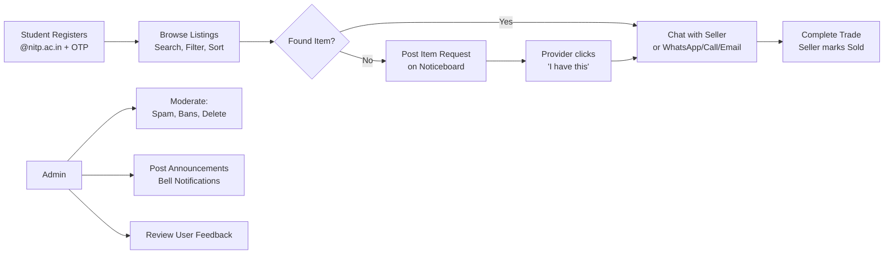

# 01 — Executive Summary

> Back to [README](./README.md)

---

## What Is This?

**NIT Patna Market** is a full-stack **MERN** (MongoDB, Express, React, Node.js) campus marketplace web application built exclusively for **NIT Patna students**. It enables students to list, browse, and buy second-hand items (textbooks, electronics, furniture, etc.) with in-app buyer–seller chat, admin moderation, campus announcements, and an item requests noticeboard.

---

## The 30-Second Pitch

> "NIT Patna Market is a MERN campus marketplace where verified NIT Patna students list and buy second-hand items. It features OTP-verified signup via Resend, a Verified Student badge system using `@nitp.ac.in` emails, multi-image listings on Cloudinary CDN, buyer–seller chat with polling, an item requests noticeboard, optimistic wishlist UI, daily email digest notifications, and a full admin dashboard — all deployed as a PWA on Vercel and Render."

---

## The 2-Minute Pitch

Expand the 30-second pitch with:

- **Architecture:** React SPA on Vercel, REST API on Render, MongoDB Atlas.
- **Security:** bcrypt passwords, JWT protected routes, seller-only edit/delete, admin middleware chain, OTP hashing with SHA-256.
- **UX highlights:** Dark glassmorphism UI, inbox split view, draft conversations, read receipts (✓/✓✓), splash screen animation.
- **Trade-off:** Polling over WebSockets for simpler deployment and stateless scaling.
- **Notification system:** NotificationQueue → daily cron → batched digest emails via Resend.

---

## Quick Reference Card

| Item | Detail |
|------|--------|
| **Name** | NIT Patna Market / Campus Market |
| **Type** | Full-stack MERN marketplace SPA |
| **Users** | NIT Patna students (`@nitp.ac.in`) + configured admin emails |
| **Frontend** | React 18, Vite 8, React Router 6, Axios, vanilla CSS |
| **Backend** | Node.js, Express 4, Mongoose 8 |
| **Database** | MongoDB (Atlas in production) |
| **Auth** | JWT (7-day expiry), bcrypt (cost 12), OTP via Resend |
| **Images** | Multer (memory) → Cloudinary CDN (fallback: local `/uploads/`) |
| **Deploy** | Frontend: Vercel · Backend: Render |
| **Real-time** | **No WebSockets** — HTTP polling for messages |
| **Notifications** | Resend Email API + daily digest cron |
| **Mobile** | Progressive Web App (PWA, installable) |

---

## Core User Flows

### Flow Breakdown

1. **Register / Login** → `@nitp.ac.in` email + OTP verification. JWT stored in `localStorage` → `AuthContext`.
2. **Browse** → `GET /api/products` with search, category, min/max price filters (debounced 350ms).
3. **Sell** → multi-image upload (up to 8) → `POST /api/products`.
4. **Product detail** → WhatsApp deep linking, wishlist save, chat with seller, comments.
5. **Item Requests** → Users post items they want to buy on a public noticeboard.
6. **Inbox** → `/messages` split view; draft chat from listing when no messages yet.
7. **Profile** → avatar (Cloudinary/local), phone, delete account with full cascade.
8. **Admin** → dashboard: users, products, spam, bans, announcements, feedback.

---

*Next: [System Architecture →](./02-system-architecture.md)*
