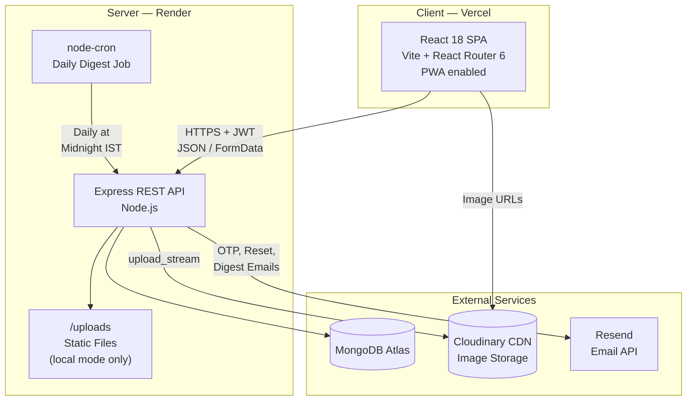
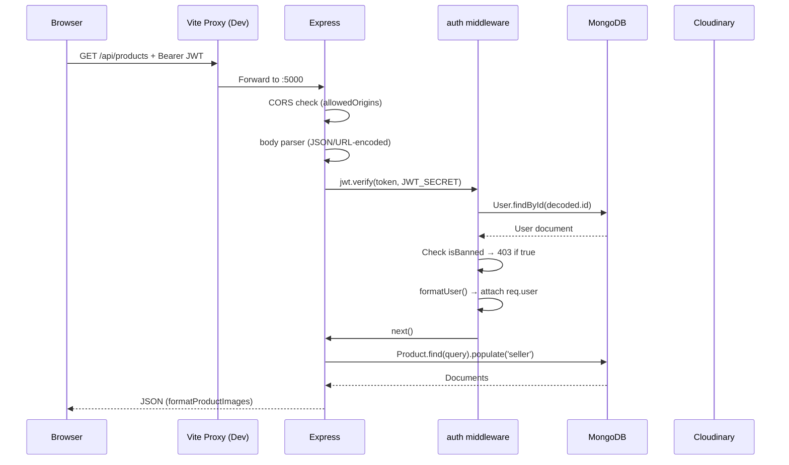
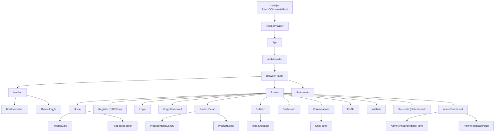

# 02 — System Architecture

> Back to [README](./README.md) · Previous: [Executive Summary](./01-executive-summary.md)

---

## High-Level Architecture

---

## Request Lifecycle (Authenticated API Call)

---

## Component Architecture (Frontend)

---

## Key Architectural Decisions

| Decision | Reasoning |
|----------|-----------|
| **Separate SPA + API** | Independent deployment on Vercel (static) + Render (server) |
| **HTTP polling, not WebSockets** | Stateless, simpler hosting, acceptable latency for marketplace |
| **JWT, not sessions** | Stateless API, horizontal scaling without session store |
| **Cloudinary with local fallback** | CDN persistence in production, zero-config local dev |
| **Monolithic Express** | Appropriate for team size and feature scope |

---

*Next: [Technology Stack →](./03-technology-stack.md)*
