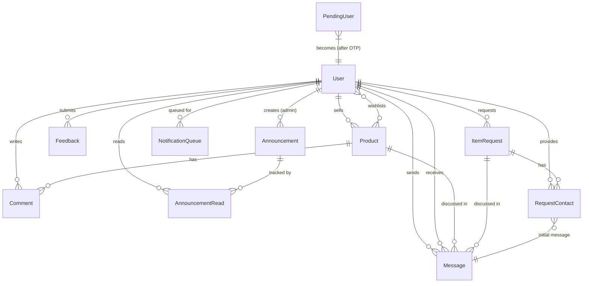

# 05 — Database Design

> Back to [README](./README.md) · Previous: [Project Structure](./04-project-structure.md)

---

## Entity Relationship Diagram

---

## User (`models/User.js`)

| Field | Type | Constraints | Purpose |
|-------|------|-------------|---------|
| `name` | String | required, trimmed | Display name |
| `email` | String | required, unique, lowercase | Login identifier |
| `password` | String | required | bcrypt hash (cost 12) |
| `role` | String | enum: `user`, `admin` | Access level |
| `isBanned` | Boolean | default: false | Suspension flag |
| `isEmailVerified` | Boolean | default: false | OTP verification status |
| `phone` | String | optional | Indian mobile format |
| `avatarUrl` | String | optional | Cloudinary or local path |
| `isVerifiedStudent` | Boolean | default: false | `@nitp.ac.in` check |
| `wishlist` | ObjectId[] | ref: Product | Saved listings |
| `lastEmailedAt` | Date | nullable | Digest rate limiting |
| `resetPasswordOtpHash` | String | optional | SHA-256 of reset OTP |
| `resetPasswordOtpExpires` | Date | nullable | 10-min expiry |

**Pre-save hooks:**
1. Auto-promote to `admin` if email matches `config/admins.js`
2. Hash password only when modified (`isModified('password')`) — bcrypt cost 12

---

## Product (`models/Product.js`)

| Field | Type | Constraints | Purpose |
|-------|------|-------------|---------|
| `title` | String | required, trimmed | Listing name |
| `description` | String | required | Full description |
| `price` | Number | required, min: 0 | Price in ₹ |
| `category` | String | enum (7 values) | Classification |
| `imageUrls` | String[] | default: [] | All image URLs |
| `imageUrl` | String | auto-synced | Primary image (backward compat) |
| `seller` | ObjectId | ref: User, required | Owner reference |
| `status` | String | enum: `available`, `sold` | Listing state |
| `isSpam` | Boolean | default: false | Admin moderation flag |

**Categories:** `Books`, `Electronics`, `Clothing`, `Furniture`, `Stationery`, `Sports`, `Other`

**Pre-save hook:** Syncs `imageUrl = imageUrls[0]` for backward compatibility.

---

## Message (`models/Message.js`)

| Field | Type | Constraints | Purpose |
|-------|------|-------------|---------|
| `product` | ObjectId | ref: Product, nullable | Product context |
| `itemRequest` | ObjectId | ref: ItemRequest, nullable | Request context |
| `sender` | ObjectId | ref: User, required | Message author |
| `receiver` | ObjectId | ref: User, required | Message recipient |
| `text` | String | required, maxlength: 1000 | Message content |
| `read` | Boolean | default: false | Read receipt |

**Validation:** Must belong to exactly one context (product XOR itemRequest).

**Indexes:**
- `{ product: 1, sender: 1, receiver: 1 }`
- `{ itemRequest: 1, sender: 1, receiver: 1 }`
- `{ receiver: 1, read: 1 }` — optimizes unread count queries

---

## PendingUser (`models/PendingUser.js`)

| Field | Type | Purpose |
|-------|------|---------|
| `email` | String | Signup email (unique) |
| `name` | String | User's name |
| `password` | String | Pre-hashed password |
| `otpHash` | String | SHA-256 of 6-digit OTP |
| `otpExpires` | Date | 10-minute expiry |
| `attempts` | Number | Failed OTP attempts (max 5) |
| `lastSentAt` | Date | Rate limit (60s cooldown) |
| `createdAt` | Date | **TTL: 900s** (auto-delete after 15 min) |

---

## ItemRequest (`models/ItemRequest.js`)

| Field | Type | Purpose |
|-------|------|---------|
| `title` | String | What the user is looking for |
| `description` | String | Detailed requirements |
| `requester` | ObjectId | Who posted the request |
| `status` | String | `open` or `fulfilled` |
| `category` | String | Same 7 categories as Product |

---

## RequestContact (`models/RequestContact.js`)

| Field | Type | Purpose |
|-------|------|---------|
| `itemRequest` | ObjectId | Which request |
| `provider` | ObjectId | Who clicked "I have this" |
| `requester` | ObjectId | Request owner |
| `initialMessage` | ObjectId | Auto-generated first message |
| `notifiedAt` | Date | When notification was sent |

**Indexes:** `{ itemRequest: 1, provider: 1 }` unique — prevents duplicate contacts.

---

## Other Models

| Model | Key Fields | Purpose |
|-------|-----------|---------|
| **Announcement** | title, message, priority (`low`/`normal`/`high`/`urgent`), active, expiresAt, createdBy | Admin campus notices |
| **AnnouncementRead** | user, announcement (unique compound) | Per-user read tracking |
| **Comment** | product, user, text (max 500) · Index: `{ product: 1, createdAt: -1 }` | Product discussions |
| **Feedback** | user, subject, message, status (`open`/`read`/`resolved`) | User reports to admin |
| **NotificationQueue** | user, category (`inbox`/`item`/`request`), message, relatedUrl | Pending digest notifications |

---

## Database Collections Summary

| Collection | Model | Purpose |
|------------|-------|---------|
| `users` | User.js | Auth, profile, role, ban |
| `products` | Product.js | Listings, images, spam |
| `messages` | Message.js | Buyer–seller chat per context |
| `comments` | Comment.js | Product comments |
| `announcements` | Announcement.js | Campus notices |
| `announcementreads` | AnnouncementRead.js | Per-user read state |
| `feedbacks` | Feedback.js | User → admin feedback |
| `itemrequests` | ItemRequest.js | "Looking for X" noticeboard |
| `requestcontacts` | RequestContact.js | "I have this" tracking |
| `pendingusers` | PendingUser.js | OTP signup temp state |
| `notificationqueues` | NotificationQueue.js | Pending digest emails |

---

*Next: [Authentication & Authorization →](./06-auth.md)*
