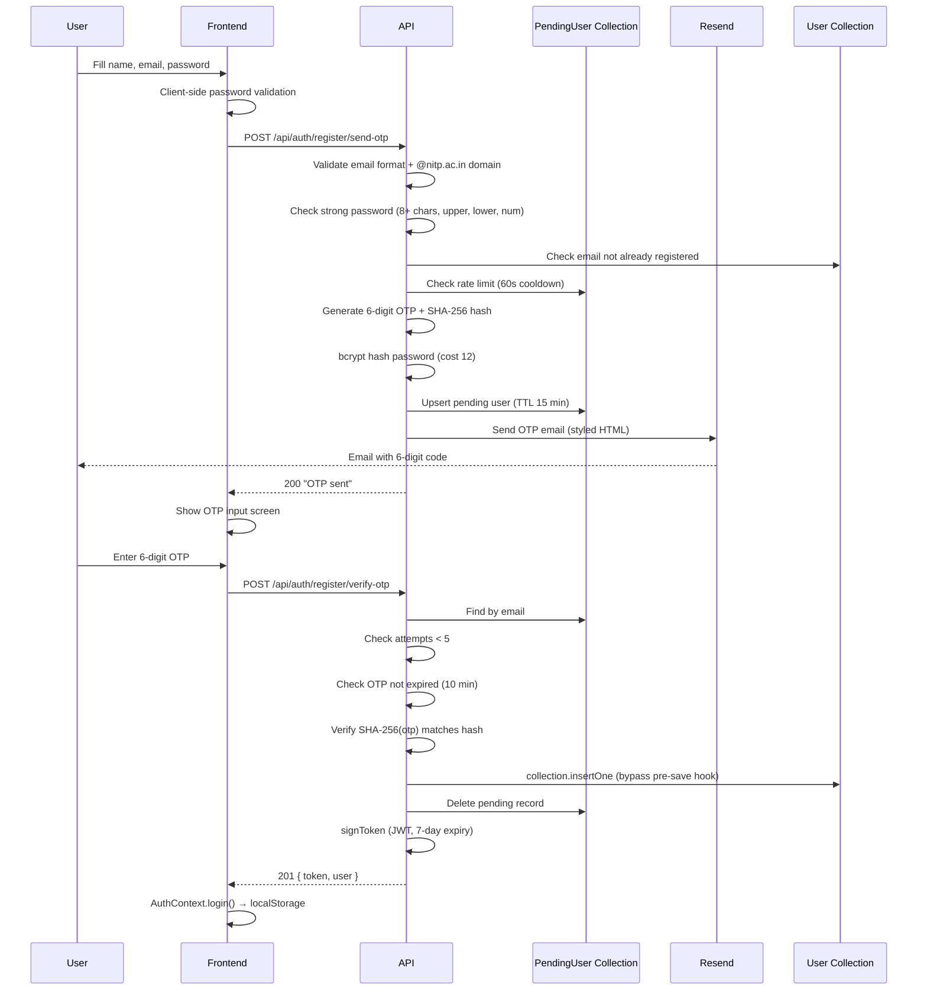
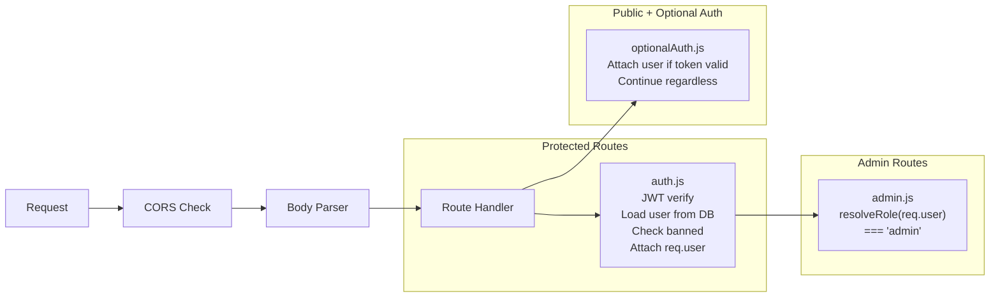

# 06 — Authentication & Authorization

> Back to [README](./README.md) · Previous: [Database Design](./05-database-design.md)

---

## OTP Registration Flow



> **Dev mode bypass:** When `RESEND_API_KEY=re_your_api_key_here` (dummy key) and `NODE_ENV=development`, the OTP is printed to the backend terminal instead of being emailed.

---

## Password Policy

```
✓ Minimum 8 characters
✓ At least one uppercase letter (A-Z)
✓ At least one lowercase letter (a-z)
✓ At least one number (0-9)
```

Enforced on both **client** (`Register.jsx` real-time validation) and **server** (`isStrongPassword()` in `authRoutes.js`).

---

## JWT Token Structure

```javascript
jwt.sign({
  id: user._id,
  name: user.name,
  email: user.email,
  role: user.role,          // 'user' or 'admin'
  isAdmin: true/false,
  avatarUrl: user.avatarUrl
}, JWT_SECRET, { expiresIn: '7d' });
```

---

## Middleware Chain



### Middleware Details

| Middleware | File | Behavior |
|-----------|------|----------|
| **auth** | `middleware/auth.js` | Extract Bearer token → `jwt.verify` → load user from DB → reject if banned (403) → attach `req.user` + `req.userDoc` |
| **admin** | `middleware/admin.js` | Runs AFTER auth. Checks `resolveRole(req.user) === 'admin'` → 403 if not |
| **optionalAuth** | `middleware/optionalAuth.js` | Same token extraction, but calls `next()` regardless. Used for announcements/requests |
| **multerUpload** | `middleware/multerUpload.js` | Memory storage, `image/*` MIME filter. Factory: `createUpload(maxFiles, maxSizeMb)` |

---

## Admin System

**Dual determination mechanism:**

1. **Config file:** `backend/config/admins.js` — hardcoded email allowlist
2. **Database field:** `User.role === 'admin'`
3. **Resolution:** `resolveRole()` returns `'admin'` if EITHER the role field OR config match

**Admin protections:**
- Admins cannot be banned via API
- Admins cannot be deleted via admin panel
- Admin promotion happens automatically on `User.save()` via pre-save hook

---

## Authorization Matrix

| Resource | Guest | User | Owner | Admin |
|----------|-------|------|-------|-------|
| Browse products | ✅ | ✅ | ✅ | ✅ |
| View product detail | ✅ | ✅ | ✅ | ✅ |
| View announcements | ✅ | ✅ | ✅ | ✅ |
| View item requests | ✅ | ✅ | ✅ | ✅ |
| Create listing | ❌ | ✅ | ✅ | ✅ |
| Edit listing | ❌ | ❌ | ✅ | ✅ |
| Delete listing | ❌ | ❌ | ✅ | ✅ |
| Mark sold/available | ❌ | ❌ | ✅ | ❌ |
| Send messages | ❌ | ✅ | ✅ | ✅ |
| Post comments | ❌ | ✅ | ✅ | ✅ |
| Delete own comment | ❌ | ✅ | ✅ | ✅ |
| Delete any comment | ❌ | ❌ | ❌ | ✅ |
| Wishlist | ❌ | ✅ | ✅ | ✅ |
| Submit feedback | ❌ | ✅ | ✅ | ✅ |
| Mark announcement read | ❌ | ✅ | ✅ | ✅ |
| Manage announcements | ❌ | ❌ | ❌ | ✅ |
| Ban users | ❌ | ❌ | ❌ | ✅ |
| Flag spam | ❌ | ❌ | ❌ | ✅ |
| Delete users | ❌ | ❌ | ❌ | ✅ |
| View admin stats | ❌ | ❌ | ❌ | ✅ |

---

*Next: [Backend Deep Dive →](./07-backend.md)*
