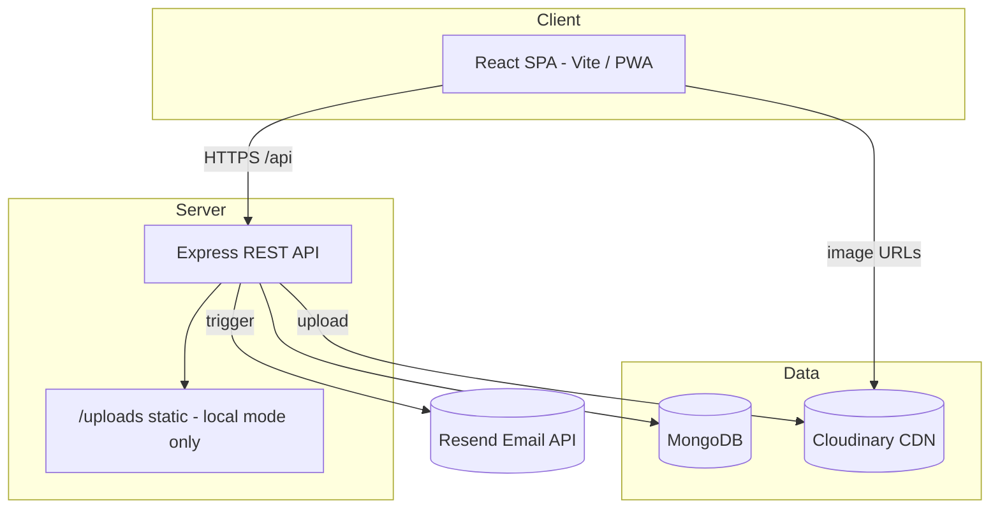
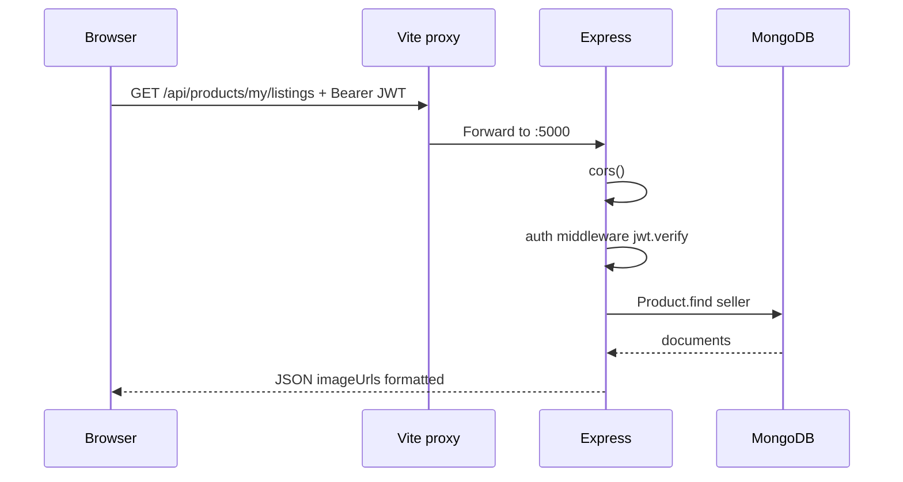
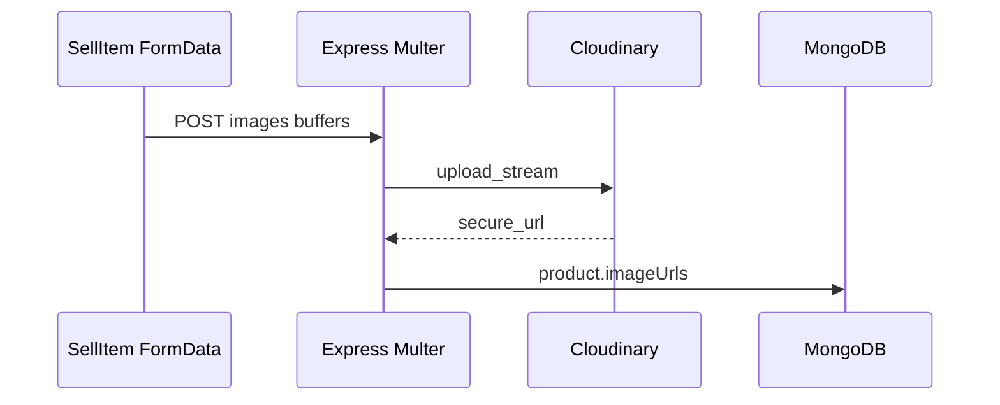

# Interview Guide — NIT Patna Market (College Marketplace)

> **Read this after** [01-overview](./01-overview.md) and [02-architecture](./02-architecture.md).  
> All answers below are grounded in **this repository’s actual code** (May 2026).  
> If something is not implemented, it is labeled **Not in this project**.

---

## Table of contents

1. [Project at a glance](#project-at-a-glance)
2. [What is NOT in this project](#what-is-not-in-this-project)
3. [Beginner questions](#beginner-questions)
4. [Intermediate questions](#intermediate-questions)
5. [Advanced questions](#advanced-questions)
6. [AI / LLM questions (scope clarification)](#ai--llm-questions-scope-clarification)
7. [Why this instead of that](#why-this-instead-of-that)
8. [Problems faced during development](#problems-faced-during-development)
9. [Deep technical concepts](#deep-technical-concepts)
10. [Architecture deep dive](#architecture-deep-dive)
11. [Resume & HR questions](#resume--hr-questions)
12. [Top 100 likely interview questions](#top-100-likely-interview-questions)

---

## Project at a glance

| Item | Detail (from codebase) |
|------|-------------------------|
| **Name** | NIT Patna Market / Campus Market |
| **Type** | Full-stack MERN marketplace SPA |
| **Users** | NIT Patna students (`@nitp.ac.in`) + configured admin emails |
| **Frontend** | React 18, Vite 8, React Router 6, Axios, plain CSS |
| **Backend** | Node.js, Express 4, Mongoose 8 |
| **Database** | MongoDB (Atlas in production) |
| **Auth** | JWT (7-day expiry), bcrypt password hashing |
| **Images** | Multer (memory) → **Cloudinary** when env set, else local `backend/uploads/` |
| **Deploy** | Frontend: Vercel · Backend: Render (per `server.js` CORS + docs) |
| **Real-time** | **No WebSockets** — HTTP polling for messages |
| **Notifications** | Resend Email API |
| **Mobile** | Progressive Web App (PWA) |

### Core user flows

1. **Register / Login** → `@nitp.ac.in` grants Verified Student badge. JWT stored in `localStorage` → `AuthContext`
2. **Browse** → `GET /api/products` with search, category, min/max price filters (debounced 350ms)
3. **Sell** → multi-image upload (up to 8) → `POST /api/products`
4. **Product detail** → WhatsApp deep linking, save to Wishlist, chat with seller
5. **Item Requests** → Users post items they want to buy on a noticeboard
6. **Inbox** → `/messages` split view; draft chat from listing when no messages yet
7. **Profile** → avatar (Cloudinary/local), phone, delete account
8. **Admin** → dashboard: users, products, spam, bans, announcements, feedback

---

## What is NOT in this project

Be honest in interviews — do **not** claim these exist:

| Topic | Status |
|-------|--------|
| LLM / ChatGPT / AI features | **Not implemented** |
| RAG / embeddings / vector DB | **Not implemented** |
| Prompt engineering / tool calling | **Not implemented** |
| WebSockets / Socket.io | **Not implemented** (polling only) |
| Payment gateway (Razorpay/Stripe) | **Not implemented** |
| Email OTP verification (active flow) | Fields exist; registration sets `isEmailVerified: true` without OTP in current `authRoutes.js` |
| Redux / Zustand | **Not used** (Context API only) |
| TypeScript | **Not used** |
| Redis / session store | **Not used** (stateless JWT) |
| Automated tests (Jest/Cypress) | **Not found in repo** |
| CI/CD config in repo | **Not found** (may exist externally) |

SMTP variables exist in `.env.example` for optional email; not required for core flows.

---

## Beginner questions

### What problem does this project solve?

Students need a **trusted, campus-scoped** place to buy/sell used items (books, electronics, etc.) without scattered WhatsApp groups. This app centralizes listings, search, seller contact via in-app chat, and admin moderation.

### What technologies are used?

**MERN**: MongoDB, Express, React, Node.js — plus JWT, bcrypt, Multer, Cloudinary (optional), Mongoose, Vite, Axios, React Router.

### How does the application work (high level)?

1. User authenticates → receives JWT.  
2. Frontend attaches JWT on API calls via Axios interceptor.  
3. Listings stored in MongoDB; images on Cloudinary or local disk.  
4. Buyers message sellers per product; messages stored in MongoDB; UI polls for updates.  
5. Admins moderate spam, bans, announcements, and feedback.

### Explain the project in 30 seconds

> “NIT Patna Market is a MERN campus marketplace where students list and buy second-hand items. It features a Verified Student badge system via college emails, a dedicated item requests board, and optimistic wishlist saves. It has buyer–seller chat, automatic email notifications via Resend, and it’s a fully installable PWA for mobile users.”

### Explain the project in 2 minutes

Expand the 30-second pitch with:

- **Architecture**: React SPA on Vercel, REST API on Render, MongoDB Atlas.  
- **Security**: bcrypt passwords, JWT on protected routes, seller-only edit/delete, admin middleware.  
- **UX**: dark glassmorphism UI, inbox split view, image gallery on product page, feedback section on homepage.  
- **Trade-off**: polling instead of WebSockets for simpler deployment and stateless scaling.

### Who can sign up?

From `authRoutes.js`: emails ending with **`@nitp.ac.in`**, plus emails in `backend/config/admins.js`. Strong password rules (8+ chars, upper, lower, number).

### Is this a real-time chat app?

**No.** It feels near-real-time because the client **polls** (`ChatPanel.jsx`: 15s interval; `Navbar.jsx`: 10s for unread count). True real-time would need WebSockets.

---

## Intermediate questions

### Explain the architecture



### Explain the data flow for creating a listing

1. `SellItem.jsx` builds `FormData` with title, description, price, category, and up to 8 image files.  
2. `POST /api/products` → `auth` middleware → `multer` memory storage → `imageStorage.uploadFiles()` → Cloudinary or disk.  
3. `Product.create({ imageUrls, ... })` — `pre('save')` syncs `imageUrl` to first image.  
4. Response includes normalized `imageUrls` via `formatProductImages()`.

### Why React + Vite?

- **React**: component reuse (cards, chat panel, admin panels).  
- **Vite**: fast HMR and dev server; proxies `/api` and `/uploads` to backend (`vite.config.js` → port **5000**).

### Why MongoDB?

Document model fits listings (variable categories, arrays like `imageUrls`, embedded refs). Mongoose gives schema validation, hooks (password hash, sync `imageUrl`), and `populate()` for seller data.

### Why JWT instead of sessions?

Stateless API: no server session store; scales horizontally on Render. Token in `localStorage`; verified in `middleware/auth.js` with `JWT_SECRET`.

### How does authentication work?

1. Login/register → `jwt.sign({ id, name, email, role, isAdmin, avatarUrl }, JWT_SECRET, { expiresIn: '7d' })`.  
2. Client stores token + user in `localStorage`.  
3. `axios.js` interceptor adds `Authorization: Bearer <token>`.  
4. `auth` middleware: verify token → load user from DB → reject if banned.  
5. `optionalAuth` used for announcements list (read state when logged in).

### How is state managed on the frontend?

- **Global**: `AuthContext` — user, login/logout, `updateUser`, `isAdmin`.  
- **Local**: `useState` / `useEffect` per page.  
- **No Redux.**

### How do admin roles work?

Dual mechanism (`config/admins.js` + `User.role`):

- Allowlisted emails become `admin` on save (`User` pre-save hook).  
- `middleware/admin.js` checks `resolveRole(req.user) === 'admin'`.  
- Admins cannot be banned/deleted via admin API.

### How do product images work?

- Up to **8** images per listing (`MAX_PRODUCT_IMAGES` in `productImages.js`).  
- **Cloudinary** when `CLOUDINARY_*` env vars set (`utils/imageStorage.js`).  
- Else local `backend/uploads/` (ephemeral on Render — see problems section).  
- Frontend: `ImageUploader.jsx` with × to remove before submit; `ProductImageGallery.jsx` on detail page.

### How do announcements work?

- **Public**: `GET /api/announcements` (optional auth for read flags).  
- **Users**: mark read → `AnnouncementRead` collection.  
- **Admins**: CRUD under `/api/admin/announcements`.  
- UI: `NotificationBell.jsx` in navbar.

### How does feedback work?

- Users: `POST /api/feedback` (auth) from homepage `FeedbackSection.jsx`.  
- Admins: inbox under `/api/admin/feedback` with status `open` | `read` | `resolved`.

---

## Advanced questions

### Design trade-offs

| Decision | Benefit | Cost |
|----------|---------|------|
| Polling vs WebSockets | Simple, stateless, easy deploy | 10–15s latency, more HTTP load |
| JWT in localStorage | Easy SPA auth | XSS can steal token |
| MongoDB regex search | Simple to implement | Slow at large scale without text index |
| Cloudinary optional | Local dev without account | Risk of accidental local-only prod deploy |
| Plain CSS | Full design control, no bundle bloat | No design system team scale |
| Monolithic Express | One deployable unit | All features scale together |

### Scalability bottlenecks (as implemented)

1. **MongoDB `$regex` search** on title — collection scan.  
2. **Polling** — N users × intervals = many read requests.  
3. **No CDN** for API (only for images if Cloudinary).  
4. **Single Node process** on Render free tier — CPU/memory limits.  
5. **No rate limiting** on auth or POST endpoints in code.

### How would you redesign for 1M users?

1. **WebSockets** (Socket.io) or SSE for chat; keep MongoDB as source of truth.  
2. **Elasticsearch** or Atlas Search for listings.  
3. **Redis** for rate limits, unread counts cache.  
4. **CDN** for frontend; horizontal API scaling behind load balancer.  
5. **Refresh tokens** in httpOnly cookies; short-lived access JWT.  
6. **Message queue** for image processing.  
7. **Read replicas** for MongoDB.  
8. **Partition** messages by time or archive old threads.

### Security risks (honest)

| Risk | Mitigation in repo | Ideal production |
|------|-------------------|------------------|
| XSS → token theft | None specific | httpOnly cookies, CSP |
| JWT in localStorage | 7-day expiry | refresh tokens, shorter TTL |
| No rate limiting | — | express-rate-limit |
| File upload abuse | MIME check, 5MB limit | virus scan, signed URLs |
| IDOR on products | seller check on mutate | audit tests |
| Admin emails in code | config file | env-based admin bootstrap |
| CORS misconfiguration | allowlist + Vercel regex | strict production list |

### Why is `GET /my/listings` registered before `GET /:id`?

Express matches in order. Otherwise `"my"` would be treated as an ObjectId in `/:id` and throw CastError. Classic Express routing interview point.

---

## AI / LLM questions (scope clarification)

**This project does not use LLMs, embeddings, RAG, or tool calling.**

If an interviewer assumes AI because it’s a modern web app, say:

> “This codebase is a traditional MERN marketplace — no OpenAI or vector database. If we added AI later, we might use an LLM for listing description suggestions or scam detection, with RAG over policy docs — but that would be a new service, not what’s deployed today.”

### Reference answers (theory only — not implemented here)

| Question | Short theory answer |
|----------|---------------------|
| What is an LLM? | Neural model trained to predict text; used for chat, summarization, etc. |
| What is a token? | Subword unit billed/processed by LLM APIs; context limits are in tokens. |
| What is hallucination? | Model generating plausible but false facts; mitigated by RAG, grounding, lower temperature. |
| RAG vs fine-tuning? | RAG retrieves external docs at query time; fine-tuning changes model weights. |
| Tool calling? | LLM returns structured call to a function (e.g. search DB); app executes and returns result. |

---

## Why this instead of that

### MERN vs Next.js full-stack

| MERN (this project) | Next.js |
|---------------------|---------|
| Separate SPA + API | Combined app/router |
| Simple mental model for learning | SSR/SEO built-in |
| Vite dev experience | Heavier framework |

**Interview line:** “I chose a decoupled SPA and REST API so frontend and backend could deploy independently on Vercel and Render.”

### MongoDB vs PostgreSQL

| MongoDB | PostgreSQL |
|---------|------------|
| Flexible documents, `imageUrls` arrays | Strict schema, great joins |
| `populate()` instead of SQL JOIN | ACID, complex queries native |

**Interview line:** “Listings are document-shaped with arrays and refs; MongoDB + Mongoose matched the MERN stack and rapid iteration.”

### JWT vs server sessions

| JWT | Sessions |
|-----|----------|
| Stateless API | Server stores session |
| Easy horizontal scale | Needs Redis for multi-instance |

### Polling vs WebSockets

| Polling (used) | WebSockets |
|----------------|------------|
| REST only, stateless | Persistent connection |
| 10–15s delay acceptable | Sub-second delivery |

### Cloudinary vs local uploads

| Cloudinary (production intent) | Local `/uploads` |
|-------------------------------|------------------|
| Permanent URLs, CDN | Lost on Render redeploy |
| See `docs/CLOUDINARY_SETUP.md` | Dev fallback in `imageStorage.js` |

### Context API vs Redux

| Context (used) | Redux |
|----------------|-------|
| Only auth is global | Many slices of global state |

---

## Problems faced during development

*(Documented from implementation and fixes in this repo — use as “challenges” stories.)*

### 1. Login / API timeout (port mismatch)

- **Problem:** Frontend proxy targeted wrong port; requests hung.  
- **Root cause:** `vite.config.js` must match `PORT` in `backend/.env` (5000).  
- **Solution:** Align proxy to `http://localhost:5000`.  
- **Lesson:** Always verify proxy target vs `server.listen(PORT)`.

### 2. Images replaced by random photos

- **Problem:** Listing photos changed to unrelated images after days.  
- **Root cause:** (a) Render ephemeral disk deleted `/uploads` files; (b) frontend `onError` fell back to **picsum.photos**.  
- **Solution:** Neutral placeholder on error; Cloudinary integration; require real uploads.  
- **Lesson:** Never use random URL fallbacks for user content; use cloud storage in production.

### 3. Profile picture not persisting after logout

- **Problem:** Avatar showed in session but gone after re-login.  
- **Root cause:** Axios set `Content-Type: multipart/form-data` without boundary — file not parsed.  
- **Solution:** Delete `Content-Type` for `FormData` in interceptor; refresh user via `GET /auth/me` on load.  
- **Lesson:** Let the browser set multipart boundaries.

### 4. “Chat with Seller” opened empty inbox

- **Problem:** New chats showed “No messages yet” with no composer.  
- **Root cause:** `Conversations.jsx` only selected threads that already existed in `GET /conversations`.  
- **Solution:** Bootstrap **draft chat** from `?product=&user=` query params + `ChatPanel`.  
- **Lesson:** Deep-link flows need UI state for “zero messages” case.

### 5. MongoDB connection failures locally

- **Problem:** Backend exits on connect error.  
- **Root cause:** Invalid Atlas credentials or IP not allowlisted.  
- **Solution:** Fix `MONGO_URI`, Atlas Network Access.  
- **Lesson:** `connectDB` fails fast — check `.env` first.

### 6. Multipart upload on Render

- **Problem:** Large images fail or slow.  
- **Root cause:** Memory storage + Cloudinary upload latency.  
- **Solution:** 5MB limit per file, max 8 images; Cloudinary stream upload.  
- **Lesson:** Cap file count and size at API layer.

---

## Deep technical concepts

### JWT

- **Definition:** Signed token carrying claims (user id, role).  
- **Here:** `authRoutes.js` signs; `auth.js` verifies.  
- **Mistake:** Storing sensitive data in JWT payload (it’s base64-readable).

### bcrypt

- **Definition:** Slow hash for passwords.  
- **Here:** `User` pre-save hook, cost factor 12.  
- **Mistake:** Hashing on every save even when password unchanged — avoided with `isModified('password')`.

### Mongoose populate

- **Definition:** Replace ObjectId refs with documents.  
- **Here:** Product seller, message sender, review user.  
- **Mistake:** N+1 queries if populating in loops without lean/strategies.

### Multer + memory storage

- **Definition:** Parses `multipart/form-data` into `req.files` buffers.  
- **Here:** `middleware/multerUpload.js` → `imageStorage.uploadFile()`.  
- **Mistake:** Disk storage on serverless/ephemeral hosts without persistent volume.

### CORS

- **Definition:** Browser blocks cross-origin unless server allows.  
- **Here:** `server.js` allowlist + Vercel preview regex.  
- **Mistake:** `origin: '*'` with credentials (invalid combo).

### React Context

- **Definition:** Prop drilling alternative for shared state.  
- **Here:** `AuthContext` only.  
- **Mistake:** Putting fast-changing data in context (re-renders all consumers).

### Debouncing

- **Definition:** Run function after pause in events.  
- **Here:** `Home.jsx` 350ms before `fetchProducts`.  
- **Mistake:** No cleanup — memory leak if component unmounts mid-timeout (minor here).

---

## Architecture deep dive

### Request lifecycle (authenticated API call)



### Component interaction (frontend)

```mermaid
flowchart LR
  App --> AuthProvider
  App --> Navbar
  App --> Routes
  Routes --> Home
  Routes --> ProductDetail
  Routes --> SellItem
  Routes --> Conversations
  ProductDetail --> ProductSocial
  ProductDetail --> Chat link
  Conversations --> ChatPanel
  Navbar --> NotificationBell
```

### Database collections (current)

| Collection | Model file | Purpose |
|------------|------------|---------|
| users | User.js | Auth, profile, role, ban |
| products | Product.js | Listings, imageUrls, spam |
| messages | Message.js | Buyer–seller chat per product |
| comments | Comment.js | Product comments |
| reviews | Review.js | 1–5 star reviews per user per product |
| announcements | Announcement.js | Campus notices |
| announcementreads | AnnouncementRead.js | Per-user read state |
| feedbacks | Feedback.js | User → admin feedback |

### API surface (mounted in `server.js`)

| Prefix | Router |
|--------|--------|
| `/api/auth` | authRoutes |
| `/api/products` | productRoutes |
| `/api/messages` | messageRoutes |
| `/api/comments` | commentRoutes |
| `/api/reviews` | reviewRoutes |
| `/api/admin` | adminRoutes (auth + admin) |
| `/api/announcements` | announcementRoutes |
| `/api/feedback` | feedbackRoutes |

### Error handling flow

- Routes: `try/catch` → `res.status(4xx/5xx).json({ message })`.  
- Frontend: `getApiErrorMessage()` in `utils/apiError.js`.  
- No centralized Express error middleware in repo.  
- No Sentry/monitoring integrated in code.

### Image upload flow (Cloudinary enabled)



---

## Resume & HR questions

### HR / screening

- **Why this project?** Demonstrates full-stack ownership, real users (campus), moderation, and deployment.  
- **Team or solo?** State honestly.  
- **Timeline?** State honestly.  
- **Biggest challenge?** Cloudinary + ephemeral storage story, or chat draft-thread bug.  
- **What would you improve?** WebSockets, payments, tests, rate limiting.

### After resume mentions “MERN marketplace”

- Walk through one feature end-to-end (e.g. multi-image listing).  
- Draw three boxes: React, Express, MongoDB.  
- Mention **what you did not build** (payments, AI) if asked about scope.

### System design follow-ups

- “Design notification system” → FCM + worker + unread table (you have basic unread counts today).  
- “Design payments” → escrow, webhooks, idempotency — **out of scope** currently.

---

## Top 100 likely interview questions

### Easy (1–35)

| # | Question | Brief answer |
|---|----------|--------------|
| 1 | What is this project? | Campus marketplace MERN app for NIT Patna students. |
| 2 | What stack? | MongoDB, Express, React, Node, JWT, Cloudinary optional. |
| 3 | Who are the users? | Students @nitp.ac.in + admins. |
| 4 | How do users register? | POST `/api/auth/register` with validation. |
| 5 | How do users login? | POST `/api/auth/login` → JWT. |
| 6 | Where is the token stored? | `localStorage` (token + user). |
| 7 | What is a REST API? | Resources + HTTP verbs; stateless. |
| 8 | What is MongoDB? | Document NoSQL database. |
| 9 | What is Mongoose? | ODM for schemas and validation. |
| 10 | What is React? | Component-based UI library. |
| 11 | What is a PWA? | Progressive Web App; installable on mobile. |
| 12 | What is Vite? | Dev server and bundler for frontend. |
| 12 | What is Axios? | HTTP client with interceptors. |
| 13 | What is JWT? | Signed token for auth. |
| 14 | Why hash passwords? | bcrypt in User pre-save. |
| 15 | What is CORS? | Cross-origin rules; configured in `server.js`. |
| 16 | What is Multer? | Multipart file parser. |
| 17 | What is Cloudinary used for? | Permanent image hosting when configured. |
| 18 | How many photos per listing? | Up to 8. |
| 19 | What categories exist? | Books, Electronics, Clothing, etc. (`Product.js` enum). |
| 20 | Can guests browse? | Yes; auth needed to sell/chat/post feedback. |
| 21 | What is the admin dashboard? | `/admin` — moderation + announcements + feedback. |
| 22 | What is `populate()`? | Join-like fetch of referenced users. |
| 23 | What is a SPA? | Single `index.html`; client routing. |
| 24 | What is React Router? | Maps URLs to page components. |
| 25 | What is Context API used for? | Auth state globally. |
| 26 | How is search implemented? | Query param + MongoDB regex on title. |
| 27 | What is debouncing? | 350ms delay on home search. |
| 28 | How mark item sold? | PATCH `/api/products/:id/status`. |
| 29 | Can users edit others’ listings? | No — seller check + 403. |
| 30 | What are reviews? | 1–5 stars, one per user per product. |
| 31 | What are comments? | Text on product page. |
| 32 | What is feedback feature? | Form on homepage → admin inbox. |
| 33 | What are announcements? | Admin posts; bell UI; read tracking. |
| 34 | Default backend port? | 5000 (`PORT` env). |
| 35 | Default frontend dev port? | 3000 (Vite config). |

### Medium (36–70)

| # | Question | Brief answer |
|---|----------|--------------|
| 36 | Explain architecture diagram. | SPA → Express → MongoDB + Cloudinary. |
| 37 | Explain auth flow step by step. | Register/login → JWT → interceptor → middleware. |
| 38 | How is admin determined? | Email allowlist + role field. |
| 39 | How does chat work? | POST messages; GET thread; polling. |
| 40 | Why polling interval? | ChatPanel 15s; Navbar unread 10s. |
| 41 | How are conversations grouped? | `messageRoutes` convMap by product+otherUser. |
| 42 | How are unread counts computed? | `Message.countDocuments` read:false. |
| 43 | How mark messages read? | updateMany when opening thread. |
| 44 | Can you message yourself? | Blocked in POST handler. |
| 45 | Explain multi-image edit. | keepImages JSON + new files in PUT. |
| 46 | How delete removed images? | `deleteStoredImage` Cloudinary or disk. |
| 47 | Explain `formatProductImages`. | Normalizes imageUrls + imageUrl. |
| 48 | Why optionalAuth on announcements? | Guests see list; users get read state. |
| 49 | How does NotificationBell work? | Fetches list + unread count; dropdown UI. |
| 50 | Explain ProtectedRoute. | Redirect to login if no user. |
| 51 | Explain AdminRoute. | Requires isAdmin. |
| 52 | What is `isSpam` on products? | Admin moderation flag; hidden from browse. |
| 53 | How does WhatsApp link work? | Strips characters and opens `wa.me/phone`. |
| 54 | Explain seller avatar upload. | PATCH `/auth/me` multipart → Cloudinary. |
| 55 | How remove avatar? | `removeAvatar` in form body. |
| 56 | What happens on account delete? | Cascade delete listings, messages, etc. |
| 57 | Explain Vite proxy. | `/api` → backend for same-origin dev. |
| 58 | Why FormData for uploads? | multipart encoding for files. |
| 59 | What if Cloudinary env missing? | Falls back to local (`getStorageMode()`). |
| 60 | Explain read receipts UI. | ✓ / ✓✓ from message.read field. |
| 61 | Route order `/my/listings` vs `/:id`? | Specific routes before param routes. |
| 62 | How JWT secret protected? | `.env`, not committed. |
| 63 | What data is in JWT payload? | id, name, email, role, isAdmin, avatarUrl. |
| 64 | Explain ProductSocial component. | Comments + reviews on detail page. |
| 65 | Unique review constraint? | Compound index product+user in Review model. |
| 66 | How frontend shows image gallery? | ProductImageGallery thumbnails. |
| 67 | ImageUploader remove before submit? | Client-side revoke blob URLs. |
| 68 | Deploy frontend where? | Vercel (vercel.json SPA rewrite). |
| 69 | Deploy backend where? | Render (CORS origins in server.js). |
| 70 | Environment variables needed? | MONGO_URI, JWT_SECRET, CLOUDINARY_*, FRONTEND_URL. |

### Hard (71–100)

| # | Question | Brief answer |
|---|----------|--------------|
| 71 | Trade-offs of JWT in localStorage? | XSS risk vs simplicity. |
| 72 | How scale to 100k users? | Indexes, caching, WS, CDN, replicas. |
| 73 | How fix slow search? | Text index or Elasticsearch. |
| 74 | How prevent API abuse? | Rate limit, CAPTCHA — not in repo. |
| 75 | IDOR scenarios? | Always check seller === req.user.id. |
| 76 | Horizontal scaling JWT? | Stateless — any instance with secret. |
| 77 | Sticky sessions needed? | No for API; yes if WebSockets added. |
| 78 | Migrate local images to Cloudinary? | Re-upload or migration script — manual today. |
| 79 | Eventual consistency in chat? | Polling may show delayed messages. |
| 80 | Optimistic UI for send? | ChatPanel appends on POST success. |
| 81 | Optimistic UI for Wishlist? | React state toggles before network request. |
| 82 | Database indexes used? | Some in models (e.g. AnnouncementRead); not all fields indexed. |
| 82 | Transaction for delete account? | Multiple deletes — not single Mongo transaction in code. |
| 83 | GDPR / data export? | Not implemented. |
| 84 | Content moderation at scale? | ML classification — not implemented; manual admin. |
| 85 | Payment escrow design? | Out of scope; explain hypothetically. |
| 86 | Compare WebSocket upgrade path. | Socket.io rooms per product thread. |
| 87 | Why bcrypt cost 12? | Balance security vs register latency. |
| 88 | Could use refresh tokens? | Yes — improvement; not in repo. |
| 89 | SSR for SEO on listings? | Not used; SPA; could add Next.js later. |
| 90 | Monitoring production errors? | Not in repo; suggest Sentry. |
| 91 | Load test bottlenecks? | DB regex, polling, image uploads. |
| 92 | CAP theorem for this app? | MongoDB CP in replica set; AP tradeoffs in distributed chat if scaled. |
| 93 | Why not GraphQL? | REST sufficient; simpler for MERN learning. |
| 94 | Microservices split? | Monolith appropriate for current size. |
| 95 | Announcement read race? | upsert on AnnouncementRead. |
| 96 | Feedback status workflow? | open → read → resolved. |
| 97 | Security of admin emails in repo? | Visible in config — move to env in production. |
| 98 | DNS workaround in server.js? | `node:dns/promises` setServers — Atlas connectivity aid. |
| 99 | Does this use AI? | **No.** |
| 100 | Your strongest demo flow? | Register → list with 3 photos → browse → chat → admin announce. |

---

## Quick reference: files to mention in interviews

| Topic | File(s) |
|-------|---------|
| App entry / routes | `frontend/src/App.jsx` |
| Auth state | `frontend/src/context/AuthContext.jsx` |
| API client | `frontend/src/api/axios.js` |
| JWT middleware | `backend/middleware/auth.js` |
| Products API | `backend/routes/productRoutes.js` |
| Images | `backend/utils/imageStorage.js` |
| Chat | `backend/routes/messageRoutes.js`, `frontend/src/components/ChatPanel.jsx` |
| Admin | `backend/routes/adminRoutes.js` |
| Cloudinary setup | `docs/CLOUDINARY_SETUP.md` |

---

*Last aligned with repository features: multi-image listings, Cloudinary, announcements, feedback, admin moderation, inbox draft chat, profile avatars.*
