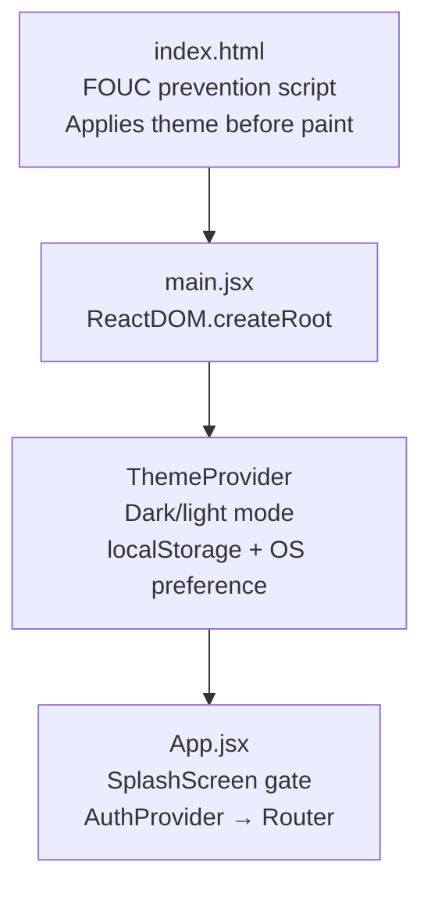

# 08 — Frontend Deep Dive

> Back to [README](./README.md) · Previous: [Backend Deep Dive](./07-backend.md)

---

## Application Bootstrap



---

## Context Providers

### AuthContext (`context/AuthContext.jsx`)

| Property | Type | Description |
|----------|------|-------------|
| `user` | Object/null | Current user from localStorage |
| `isAuthenticated` | Boolean | `!!user` |
| `isAdmin` | Boolean | `user?.isAdmin \|\| user?.role === 'admin'` |
| `login(token, user)` | Function | Store token + user in localStorage + state |
| `logout()` | Function | Clear localStorage + reset state |
| `updateUser(user)` | Function | Sync user in localStorage + state |

**Auto-refresh:** On mount, calls `GET /auth/me` to sync server state. If it fails (expired/invalid token), auto-logouts.

### ThemeContext (`context/ThemeContext.jsx`)

| Property | Type | Description |
|----------|------|-------------|
| `theme` | `'dark'`/`'light'` | Current theme |
| `setTheme(t)` | Function | Set specific theme |
| `toggleTheme()` | Function | Toggle dark ↔ light |

**Detection order:** localStorage → OS `prefers-color-scheme` → defaults to `'dark'`.

**FOUC prevention:** Inline `<script>` in `index.html` applies `data-theme` before React renders.

---

## Axios Configuration (`api/axios.js`)

```
Base URL resolution:
  - Empty VITE_API_URL → '/api' (proxied in dev)
  - 'https://my-api.render.com' → 'https://my-api.render.com/api'
  - 'https://my-api.render.com/api' → unchanged

Interceptor:
  - Attaches Bearer token from localStorage
  - Removes Content-Type for FormData (lets browser set multipart boundary)
```

---

## Pages

| Page | Route | Auth | Key Behavior |
|------|-------|------|-------------|
| **Home** | `/` | No | Hero, search (debounced 350ms), category/sort/price filters, product grid |
| **Register** | `/register` | No | Two-step: form → OTP input (60s resend cooldown) |
| **Login** | `/login` | No | Email + password → JWT |
| **ForgotPassword** | `/forgot-password` | No | Three-step: email → OTP → new password |
| **ProductDetail** | `/product/:id` | No (view) | Gallery, seller card, WhatsApp/Call/Email, chat link, wishlist, comments |
| **SellItem** | `/sell` or `/sell/:id` | Yes | Create/edit listing with up to 8 images (ImageUploader) |
| **Dashboard** | `/dashboard` | Yes | Seller's own listings with status toggling |
| **Conversations** | `/messages` | Yes | Split-view inbox with ChatPanel, draft conversations |
| **Chat** | `/chat/:productId/:otherUserId` | Yes | Standalone chat page (legacy route) |
| **Profile** | `/profile` | Yes | Avatar upload, phone, account deletion |
| **Wishlist** | `/wishlist` | Yes | Saved products grid |
| **Requests** | `/requests` | Partial | Browse open requests; auth to post or contact |
| **AdminDashboard** | `/admin` | Admin | Stats, users, products, spam, bans, announcements, feedback |

---

## Key Components

### Navbar (`components/Navbar.jsx`)
- Scroll-responsive: adds `.scrolled` class after 20px
- Desktop links + mobile hamburger drawer
- Unread message count (polls every 10s)
- Theme toggle, notification bell, user avatar
- Mobile body scroll lock when drawer open

### BottomNav (`components/BottomNav.jsx`)
- Mobile-only fixed bottom bar
- Sell FAB (floating action button)
- Unread badge on inbox (polls every 10s)
- Active route highlighting

### ChatPanel (`components/ChatPanel.jsx`)
- Polls messages every 15s
- Read receipt display (✓ sent / ✓✓ read)
- Date separators between message groups
- Header with product/request info + phone/email actions
- Enter to send, Shift+Enter for newline

### ProductCard (`components/ProductCard.jsx`)
- Image with category badge overlay
- Wishlist heart toggle (optimistic)
- Sold overlay when status is `sold`
- Seller avatar + name
- Click navigates to detail page

### SplashScreen (`components/SplashScreen.jsx`)
- Three-phase animation: enter → reveal → exit (2.8s total)
- Aurora gradient + particle effects
- Once per session (`sessionStorage`)

### NotificationBell (`components/notifications/NotificationBell.jsx`)
- Dropdown panel with announcement list
- Mark individual/all as read
- Polls every 60s
- Click-outside and Escape to close

### ProtectedRoute / AdminRoute
- `ProtectedRoute`: redirects to `/login` if not authenticated
- `AdminRoute`: redirects to `/` if not admin

---

## Notable UI Patterns

| Pattern | Where Used | How |
|---------|-----------|-----|
| **Optimistic updates** | Wishlist toggle | Updates Context state immediately, fires API call after |
| **Debounced search** | Home page | 350ms `setTimeout` with cleanup on dependency change |
| **Draft conversations** | Conversations page | URL params bootstrap synthetic thread when no messages exist |
| **FOUC prevention** | index.html | Inline script applies theme before React mounts |
| **Read receipts** | ChatPanel | ✓ (sent, unread) / ✓✓ (read) per message bubble |
| **Inline URL detection** | ProductDetail | Description auto-links URLs with regex |
| **Scroll-responsive navbar** | Navbar | CSS class toggled on `window.scrollY > 20` |

---

## Frontend Utilities

| Utility | File | Purpose |
|---------|------|---------|
| `getApiErrorMessage()` | `utils/apiError.js` | Extracts friendly message from Axios errors |
| `formatRelativeTime()` | `utils/formatDate.js` | "Just now", "5m ago", "3d ago", or date |
| `formatDateTime()` | `utils/formatDate.js` | "Jun 15, 3:30 PM" |
| `getGmailUrl()` | `utils/gmailUrl.js` | Mobile: `mailto:`, Desktop: Gmail compose URL |
| `mediaUrl()` | `utils/mediaUrl.js` | Resolve relative paths to full URLs |
| `resolveProductImageSrc()` | `utils/productImage.js` | URL → display URL (with placeholder fallback) |
| `handleProductImageError()` | `utils/productImage.js` | `img.onerror` → neutral SVG placeholder |

---

*Next: [API Reference →](./09-api-reference.md)*
