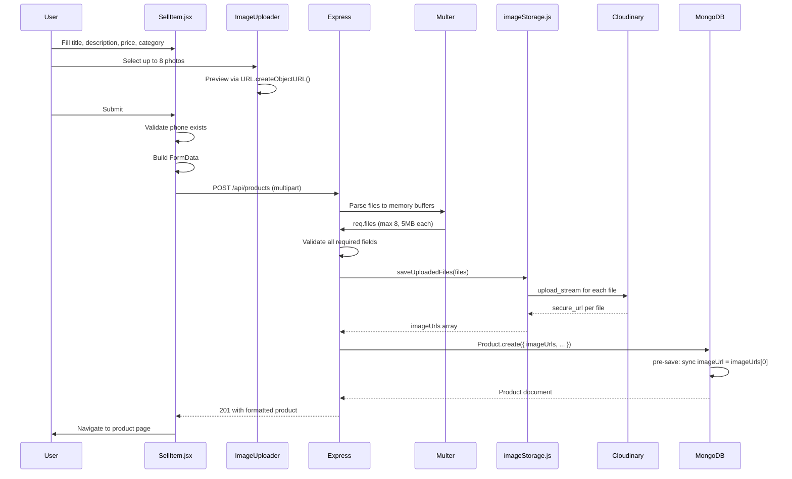
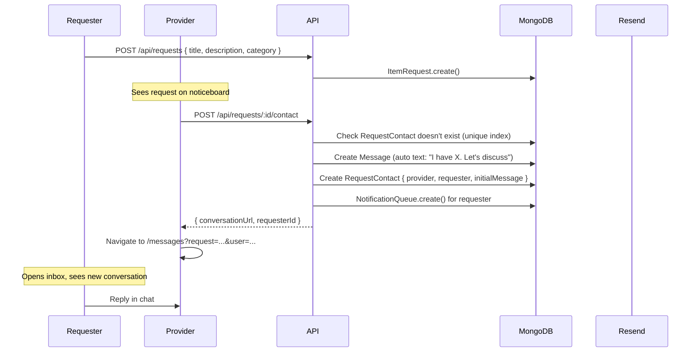
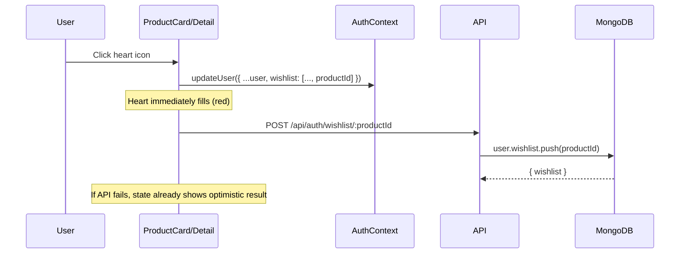
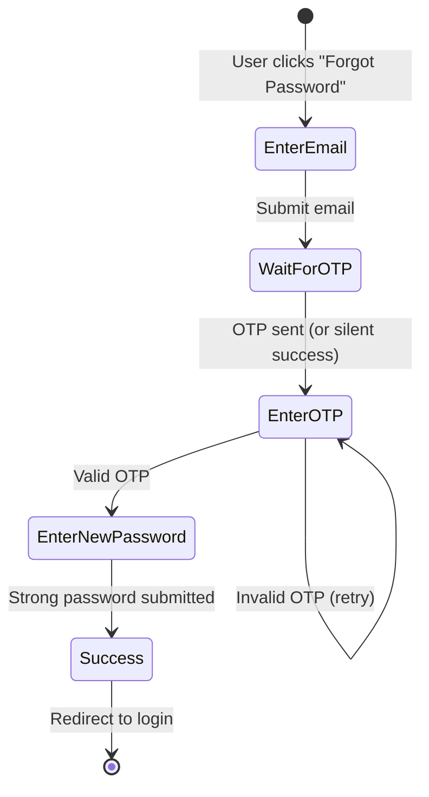

# 10 — Feature Walkthroughs

> Back to [README](./README.md) · Previous: [API Reference](./09-api-reference.md)

---

## Multi-Image Product Listing (Create)

---

## Multi-Image Product Listing (Edit)

The edit flow involves a sophisticated image reconciliation:

1. Frontend sends `keepImages` (JSON array of existing URLs to retain) + new `images[]` files.
2. Backend merges: `nextImages = [...parseKeepImages(body), ...saveUploadedFiles(files)]`.
3. Calculates removed: `previousImages.filter(url => !nextImages.includes(url))`.
4. Deletes removed images from Cloudinary/disk.
5. Validates at least 1 and at most 8 images total.

---

## Item Request → Contact → Chat Flow

---

## Optimistic Wishlist

---

## Password Reset Flow

Anti-enumeration: Always returns "If an account exists, a code has been sent" regardless of whether the email exists.

---

*Next: [Image Storage System →](./11-image-storage.md)*
