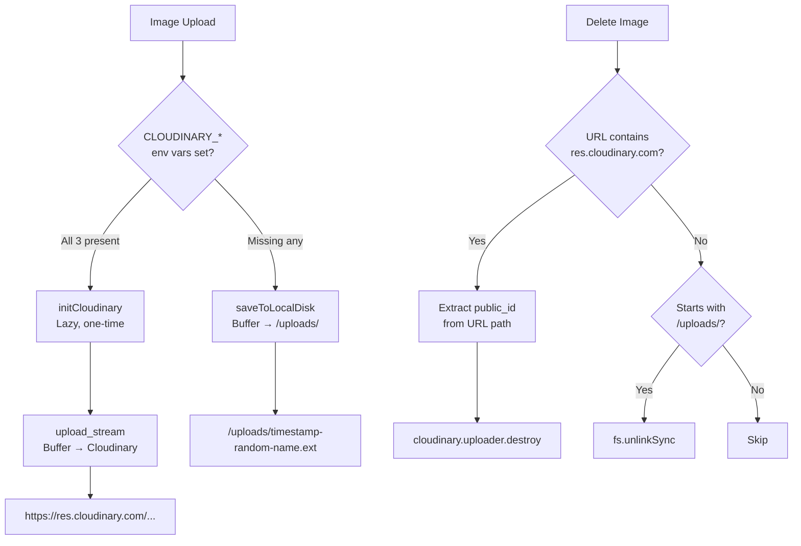

# 11 — Image Storage System

> Back to [README](./README.md) · Previous: [Feature Walkthroughs](./10-feature-walkthroughs.md)

---

## Architecture Decision

The image system uses a **Strategy Pattern** with automatic fallback, implemented in `backend/utils/imageStorage.js`.

---

## Why Dual Mode?

| Scenario | Mode | Benefit |
|----------|------|---------|
| Local development | Local disk | No Cloudinary account needed, zero config |
| Production (Render) | Cloudinary | Persistent URLs survive redeploys, fast CDN delivery |
| CI/Testing | Local disk | Fast, no network dependency |

> **WARNING:** Render's ephemeral filesystem deletes the local `/uploads/` directory on every redeploy. **Cloudinary is REQUIRED for production persistence.**

---

## Frontend Handling

The frontend utility `utils/productImage.js` handles displaying these dual URLs:

- **`resolveProductImageSrc(url)`:** Determines if the URL is an absolute Cloudinary URL, a relative `/uploads/` URL (which needs the API base prepended), or an invalid fallback.
- **`handleProductImageError(e)`:** A React `onError` handler that replaces broken images with a neutral SVG placeholder, preventing broken image icons or old legacy placeholders (like `picsum.photos`).

---

*Next: [Chat & Messaging System →](./12-chat-messaging.md)*
