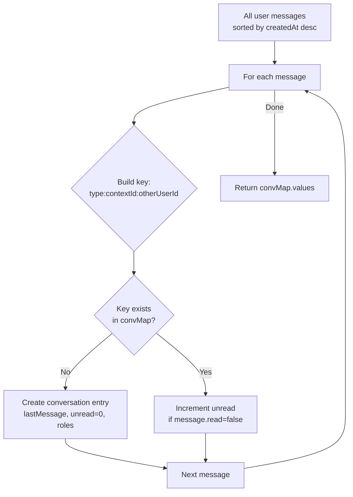
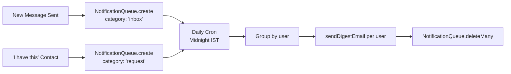

# 12 — Chat & Messaging System

> Back to [README](./README.md) · Previous: [Image Storage System](./11-image-storage.md)

---

## Architecture: HTTP Polling

This project deliberately uses **HTTP polling** instead of WebSockets. This simplifies deployment on stateless serverless or free-tier hosting (like Render) without requiring sticky sessions or a separate WebSocket server.

| Component | Poll Interval | Endpoint |
|-----------|--------------|----------|
| ChatPanel (active thread) | 15 seconds | `GET /messages/:productId/:otherUserId` |
| Navbar (unread badge) | 10 seconds | `GET /messages/unread-count` |
| BottomNav (unread badge) | 10 seconds | `GET /messages/unread-count` |
| Conversations list | 30 seconds | `GET /messages/conversations` |

---

## Conversation Grouping Algorithm

The `/messages/conversations` endpoint groups all messages by `(contextType, contextId, otherUserId)`:

---

## Message Threading Rules

**Product messages:**
- Only the seller and a buyer can initiate a thread.
- Once a thread exists, both parties can continue.

**Request messages:**
- Only a provider can initiate (via the "I have this" contact flow).
- The requester can only reply to existing threads.

---

## Read Receipts

- Messages are marked `read: true` when the recipient opens the thread.
- `updateMany` runs on thread messages from the other user.
- The UI (`ChatPanel`) shows ✓ (sent, unread) or ✓✓ (read) per message bubble.

---

## Notification Pipeline

---

*Next: [Email Notification System →](./13-email-notifications.md)*
