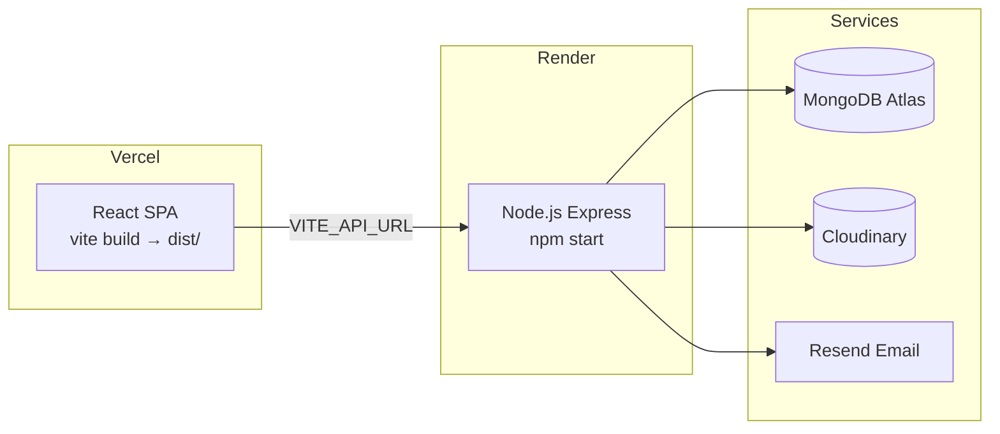

# 15 — Deployment Guide

> Back to [README](./README.md) · Previous: [Security Analysis](./14-security.md)

---

## Architecture Overview



---

## Frontend (Vercel)

1. Import the `frontend/` directory as a Vercel project.
2. Set environment variable: `VITE_API_URL=https://your-backend.onrender.com`
3. Build command: `npm run build`
4. Output directory: `dist`
5. Vercel SPA routing is handled by `vercel.json`:
   ```json
   {
     "rewrites": [
       { "source": "/(.*)", "destination": "/index.html" }
     ]
   }
   ```

---

## Backend (Render)

1. Create a new Web Service from the `backend/` directory.
2. Build command: `npm install`
3. Start command: `npm start`
4. Set required environment variables:

```env
PORT=5000
MONGO_URI=mongodb+srv://...
JWT_SECRET=<64+ character random string>
FRONTEND_URL=https://your-frontend.vercel.app
CLOUDINARY_CLOUD_NAME=your_cloud_name
CLOUDINARY_API_KEY=your_api_key
CLOUDINARY_API_SECRET=your_api_secret
RESEND_API_KEY=re_your_real_key
RESEND_FROM_EMAIL=noreply@yourdomain.com
NODE_ENV=production
```

---

## Local Development

```bash
# Terminal 1 — Backend
cd backend
cp .env.example .env  # Fill in MONGO_URI, JWT_SECRET
npm install
npm run dev            # http://localhost:5000

# Terminal 2 — Frontend
cd frontend
npm install
npm run dev            # http://localhost:3000 (proxies /api → :5000)
```

> **OTP testing locally:** Leave `RESEND_API_KEY=re_your_api_key_here` in `.env`. The OTP will be printed to the backend terminal instead of attempting to send an email.

---

*Next: [Performance & Scalability →](./16-performance.md)*
