# NIT Patna Market — Complete Technical Documentation

> **Version:** Aligned with codebase as of June 2026  
> **Purpose:** Single source of truth — architecture, implementation, APIs, deployment, security, and interview preparation  
> **Audience:** Developers, interviewers, future maintainers, and the project author

---

## Table of Contents

| # | Section | What You'll Learn |
|---|---------|-------------------|
| 1 | [Executive Summary](#1-executive-summary) | Project purpose, scope, and 30-second pitch |
| 2 | [System Architecture](#2-system-architecture) | High-level design, request lifecycle, component tree |
| 3 | [Technology Stack](#3-technology-stack) | Every library, framework, and service with rationale |
| 4 | [Project Structure](#4-project-structure) | File-by-file layout with purpose |
| 5 | [Database Design](#5-database-design) | ER diagram, all 11 models, indexes, relationships |
| 6 | [Authentication & Authorization](#6-authentication--authorization) | OTP signup, JWT, middleware chain, admin system |
| 7 | [Backend Deep Dive](#7-backend-deep-dive) | Server setup, all 8 route modules, utilities, cron jobs |
| 8 | [Frontend Deep Dive](#8-frontend-deep-dive) | React architecture, contexts, pages, components |
| 9 | [API Reference](#9-api-reference) | Every endpoint with method, auth, request/response |
| 10 | [Feature Walkthroughs](#10-feature-walkthroughs) | End-to-end flows for every major feature |
| 11 | [Image Storage System](#11-image-storage-system) | Dual-mode Cloudinary/local architecture |
| 12 | [Chat & Messaging System](#12-chat--messaging-system) | Polling architecture, conversation grouping, notifications |
| 13 | [Email Notification System](#13-email-notification-system) | Resend integration, OTP, digest cron |
| 14 | [Security Analysis](#14-security-analysis) | Current protections and known gaps |
| 15 | [Deployment Guide](#15-deployment-guide) | Vercel + Render setup, environment variables |
| 16 | [Performance & Scalability](#16-performance--scalability) | Bottlenecks and scaling strategies |
| 17 | [What This Project Does NOT Include](#17-what-this-project-does-not-include) | Honest scope boundaries |
| 18 | [Design Decisions & Trade-offs](#18-design-decisions--trade-offs) | Why X instead of Y |
| 19 | [Problems Faced & Solutions](#19-problems-faced--solutions) | Real development war stories |
| 20 | [Interview Preparation (Exhaustive)](#20-interview-preparation-exhaustive) | 150+ questions with implementation-grounded answers |

---

## 1. Executive Summary

### What Is This?

**NIT Patna Market** is a full-stack **MERN** (MongoDB, Express, React, Node.js) campus marketplace web application built exclusively for **NIT Patna students**. It enables students to list, browse, and buy second-hand items (textbooks, electronics, furniture, etc.) with in-app buyer–seller chat, admin moderation, campus announcements, and an item requests noticeboard.

### The 30-Second Pitch

> "NIT Patna Market is a MERN campus marketplace where verified NIT Patna students list and buy second-hand items. It features OTP-verified signup via Resend, a Verified Student badge system using `@nitp.ac.in` emails, multi-image listings on Cloudinary CDN, buyer–seller chat with polling, an item requests noticeboard, optimistic wishlist UI, daily email digest notifications, and a full admin dashboard — all deployed as a PWA on Vercel and Render."

### Core User Flows

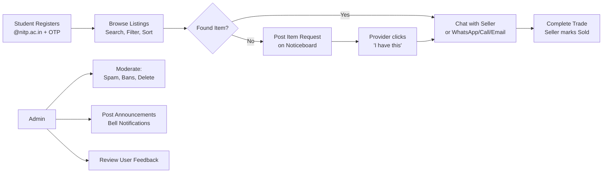

---

## 2. System Architecture

### High-Level Architecture

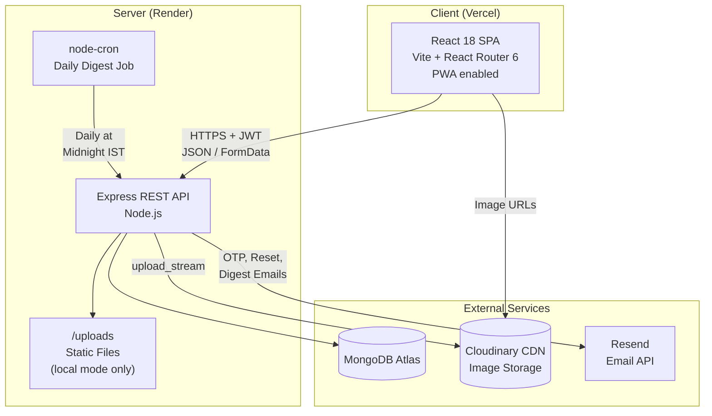

### Request Lifecycle (Authenticated Call)

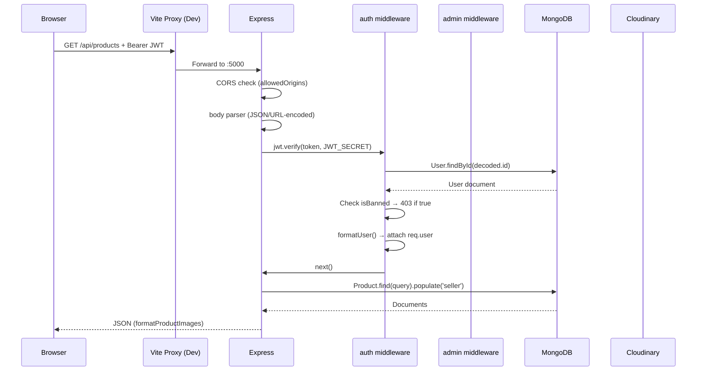

### Component Architecture (Frontend)

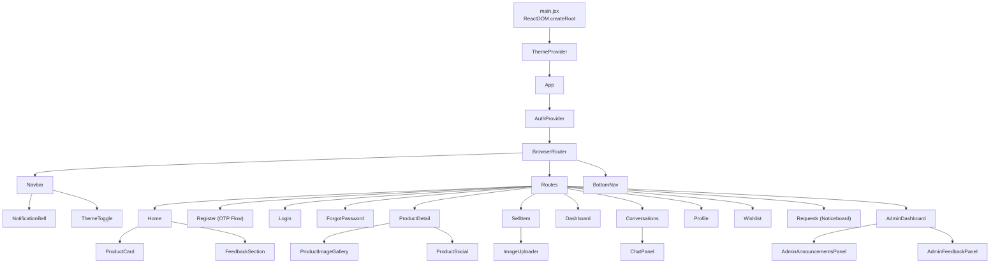

---

## 3. Technology Stack

### Backend

| Technology | Version | Purpose | Why Chosen |
|-----------|---------|---------|------------|
| **Node.js** | 18+ | Runtime | Non-blocking I/O, MERN ecosystem |
| **Express** | 4.22 | HTTP framework | Industry standard, minimal, middleware-based |
| **MongoDB** | Atlas | Database | Document model fits listings; flexible schema |
| **Mongoose** | 8.23 | ODM | Schema validation, hooks, populate() |
| **jsonwebtoken** | 9.0 | Auth tokens | Stateless JWT, horizontal scaling |
| **bcryptjs** | 2.4 | Password hashing | Slow hash, configurable cost factor |
| **Multer** | 1.4.5 | File upload | Memory storage for streaming to Cloudinary |
| **Cloudinary** | 2.10 | Image CDN | Persistent URLs, transformations, CDN delivery |
| **Resend** | 6.14 | Email delivery | OTP emails, notifications, daily digests |
| **node-cron** | 4.4 | Job scheduling | Daily email digest at midnight IST |
| **dotenv** | 16.6 | Configuration | Environment variable management |
| **cors** | 2.8 | CORS | Cross-origin request handling |
| **nodemon** | 3.1 | Dev tooling | Auto-restart on file changes |

### Frontend

| Technology | Version | Purpose | Why Chosen |
|-----------|---------|---------|------------|
| **React** | 18.3 | UI library | Component model, hooks, ecosystem |
| **Vite** | 8.0 | Build tool | Sub-second HMR, proxy support |
| **React Router** | 6.18 | Routing | Declarative client-side navigation |
| **Axios** | 1.5 | HTTP client | Interceptors for JWT attachment |
| **Vanilla CSS** | — | Styling | Full design control, no framework bloat |
| **Inter + Outfit** | Google Fonts | Typography | Modern, clean, professional |

### Infrastructure

| Service | Purpose | Tier |
|---------|---------|------|
| **Vercel** | Frontend hosting (SPA) | Free |
| **Render** | Backend hosting (API) | Free |
| **MongoDB Atlas** | Database | Free (M0) |
| **Cloudinary** | Image storage + CDN | Free |
| **Resend** | Transactional email | Free tier |

---

## 4. Project Structure

```
college-marketplace/
├── backend/
│   ├── config/
│   │   ├── admins.js              # Admin email allowlist (3 emails)
│   │   ├── cloudinary.js          # Cloudinary SDK init (lazy, idempotent)
│   │   └── db.js                  # MongoDB connection (fail-fast)
│   ├── jobs/
│   │   └── emailDigestCron.js     # Daily midnight IST digest email job
│   ├── middleware/
│   │   ├── admin.js               # Admin role check (requires auth first)
│   │   ├── auth.js                # JWT verification + banned check
│   │   ├── multerUpload.js        # Memory storage, MIME filter, size limit
│   │   └── optionalAuth.js        # Non-blocking auth (guests proceed)
│   ├── models/                    # 11 Mongoose models
│   │   ├── Announcement.js        # Campus-wide notices (CRUD by admin)
│   │   ├── AnnouncementRead.js    # Per-user read tracking
│   │   ├── Comment.js             # Product comments
│   │   ├── Feedback.js            # User → admin feedback
│   │   ├── ItemRequest.js         # "Looking for X" noticeboard
│   │   ├── Message.js             # Chat messages (product or request context)
│   │   ├── NotificationQueue.js   # Pending email notifications for digest
│   │   ├── PendingUser.js         # OTP signup temporary state (TTL 15min)
│   │   ├── Product.js             # Marketplace listings
│   │   ├── RequestContact.js      # "I have this" contact tracking
│   │   └── User.js                # Registered users
│   ├── routes/                    # 8 Express routers
│   │   ├── adminRoutes.js         # Admin CRUD (auth + admin middleware)
│   │   ├── announcementRoutes.js  # Public announcement reading
│   │   ├── authRoutes.js          # Register, login, profile, wishlist
│   │   ├── commentRoutes.js       # Product comments
│   │   ├── feedbackRoutes.js      # User feedback submission
│   │   ├── messageRoutes.js       # Chat messages + conversations
│   │   ├── productRoutes.js       # Product CRUD + image management
│   │   └── requestRoutes.js       # Item requests + contact flow
│   ├── utils/
│   │   ├── announcementQuery.js   # Shared active announcement filter
│   │   ├── formatUser.js          # Normalize user for API response
│   │   ├── imageStorage.js        # Dual-mode upload (Cloudinary/local)
│   │   ├── productImages.js       # Image list management utilities
│   │   └── resendEmail.js         # All email templates (OTP, reset, digest)
│   ├── .env.example               # All environment variables documented
│   ├── package.json               # Dependencies + scripts
│   └── server.js                  # Entry point: CORS, routes, cron
│
├── frontend/
│   ├── public/
│   │   ├── manifest.json          # PWA manifest
│   │   └── nitp-logo.png          # NIT Patna crest
│   ├── src/
│   │   ├── api/
│   │   │   └── axios.js           # Configured Axios instance + interceptor
│   │   ├── components/
│   │   │   ├── admin/
│   │   │   │   ├── AdminAnnouncementsPanel.jsx
│   │   │   │   └── AdminFeedbackPanel.jsx
│   │   │   ├── feedback/
│   │   │   │   └── FeedbackSection.jsx
│   │   │   ├── notifications/
│   │   │   │   ├── AnnouncementListItem.jsx
│   │   │   │   └── NotificationBell.jsx
│   │   │   ├── ui/
│   │   │   ├── AdminBadge.jsx
│   │   │   ├── AdminRoute.jsx
│   │   │   ├── BottomNav.jsx
│   │   │   ├── ChatPanel.jsx
│   │   │   ├── ImageLightbox.jsx
│   │   │   ├── ImageUploader.jsx
│   │   │   ├── Navbar.jsx
│   │   │   ├── ProductCard.jsx
│   │   │   ├── ProductImageGallery.jsx
│   │   │   ├── ProductSocial.jsx
│   │   │   ├── ProtectedRoute.jsx
│   │   │   └── SplashScreen.jsx
│   │   ├── context/
│   │   │   ├── AuthContext.jsx    # Global auth state
│   │   │   └── ThemeContext.jsx   # Dark/light mode
│   │   ├── pages/
│   │   │   ├── AdminDashboard.jsx
│   │   │   ├── Chat.jsx
│   │   │   ├── Conversations.jsx  # Inbox with split view
│   │   │   ├── Dashboard.jsx      # Seller's "My Listings"
│   │   │   ├── ForgotPassword.jsx
│   │   │   ├── Home.jsx           # Browse + search + filters
│   │   │   ├── Login.jsx
│   │   │   ├── ProductDetail.jsx
│   │   │   ├── Profile.jsx        # Avatar, phone, delete account
│   │   │   ├── Register.jsx       # OTP-based registration
│   │   │   ├── Requests.jsx       # Item request noticeboard
│   │   │   ├── SellItem.jsx       # Create/edit listing
│   │   │   └── Wishlist.jsx
│   │   ├── styles/
│   │   │   ├── notifications.css
│   │   │   └── profile.css
│   │   ├── utils/
│   │   │   ├── apiError.js        # Friendly error message extraction
│   │   │   ├── formatDate.js      # Relative time + date formatting
│   │   │   ├── gmailUrl.js        # Gmail compose URL (desktop/mobile)
│   │   │   ├── mediaUrl.js        # Resolve image paths to full URLs
│   │   │   └── productImage.js    # Image resolution + placeholder
│   │   ├── App.jsx                # Root component with routing
│   │   ├── index.css              # Global design system (~72KB)
│   │   └── main.jsx               # React DOM mount point
│   ├── index.html                 # HTML shell with FOUC prevention
│   ├── vercel.json                # SPA rewrite rule
│   ├── vite.config.js             # Dev server + proxy config
│   └── package.json
│
└── docs/                          # Existing documentation files
```

---

## 5. Database Design

### Entity Relationship Diagram

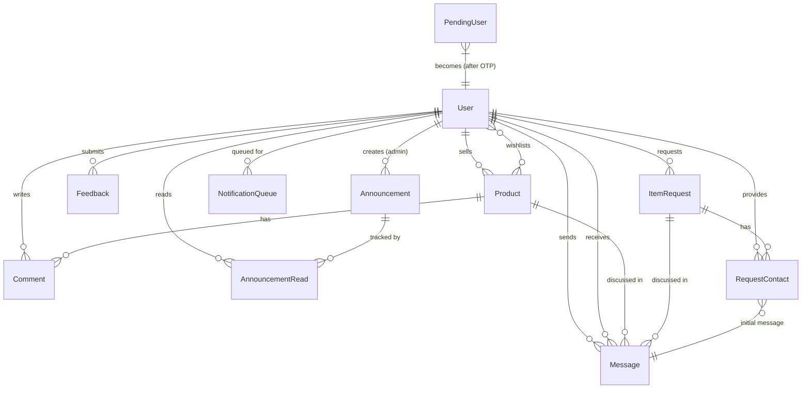

### Model Specifications

#### User (`models/User.js`)

| Field | Type | Constraints | Purpose |
|-------|------|-------------|---------|
| `name` | String | required, trimmed | Display name |
| `email` | String | required, unique, lowercase | Login identifier |
| `password` | String | required | bcrypt hash (cost 12) |
| `role` | String | enum: `user`, `admin` | Access level |
| `isBanned` | Boolean | default: false | Suspension flag |
| `isEmailVerified` | Boolean | default: false | OTP verification status |
| `phone` | String | optional | Indian mobile format |
| `avatarUrl` | String | optional | Cloudinary or local path |
| `isVerifiedStudent` | Boolean | default: false | `@nitp.ac.in` check |
| `wishlist` | ObjectId[] | ref: Product | Saved listings |
| `lastEmailedAt` | Date | nullable | Digest rate limiting |
| `resetPasswordOtpHash` | String | optional | SHA-256 of reset OTP |
| `resetPasswordOtpExpires` | Date | nullable | 10-min expiry |

**Pre-save hooks:**
1. Auto-promote to admin if email matches `config/admins.js`
2. Hash password only when modified (bcrypt cost 12)

#### Product (`models/Product.js`)

| Field | Type | Constraints | Purpose |
|-------|------|-------------|---------|
| `title` | String | required, trimmed | Listing name |
| `description` | String | required | Full description |
| `price` | Number | required, min: 0 | Price in ₹ |
| `category` | String | enum: 7 categories | Classification |
| `imageUrls` | String[] | default: [] | All image URLs |
| `imageUrl` | String | auto-synced | Primary image (backward compat) |
| `seller` | ObjectId | ref: User, required | Owner reference |
| `status` | String | enum: `available`, `sold` | Listing state |
| `isSpam` | Boolean | default: false | Admin moderation flag |

**Categories:** `Books`, `Electronics`, `Clothing`, `Furniture`, `Stationery`, `Sports`, `Other`

**Pre-save hook:** Syncs `imageUrl` to `imageUrls[0]` for backward compatibility.

#### Message (`models/Message.js`)

| Field | Type | Constraints | Purpose |
|-------|------|-------------|---------|
| `product` | ObjectId | ref: Product, nullable | Product context |
| `itemRequest` | ObjectId | ref: ItemRequest, nullable | Request context |
| `sender` | ObjectId | ref: User, required | Message author |
| `receiver` | ObjectId | ref: User, required | Message recipient |
| `text` | String | required, maxlength: 1000 | Message content |
| `read` | Boolean | default: false | Read receipt |

**Validation:** Must belong to exactly one context (product XOR itemRequest).

**Indexes:**
- `{ product: 1, sender: 1, receiver: 1 }`
- `{ itemRequest: 1, sender: 1, receiver: 1 }`
- `{ receiver: 1, read: 1 }` — for unread count queries

#### PendingUser (`models/PendingUser.js`)

| Field | Type | Purpose |
|-------|------|---------|
| `email` | String | Signup email (unique) |
| `name` | String | User's name |
| `password` | String | Pre-hashed password |
| `otpHash` | String | SHA-256 of 6-digit OTP |
| `otpExpires` | Date | 10-minute expiry |
| `attempts` | Number | Failed OTP attempts (max 5) |
| `lastSentAt` | Date | Rate limit (60s cooldown) |
| `createdAt` | Date | **TTL: 900s** (auto-delete after 15 min) |

#### ItemRequest (`models/ItemRequest.js`)

| Field | Type | Purpose |
|-------|------|---------|
| `title` | String | What the user is looking for |
| `description` | String | Detailed requirements |
| `requester` | ObjectId | Who posted the request |
| `status` | String | `open` or `fulfilled` |
| `category` | String | Same 7 categories as Product |

#### RequestContact (`models/RequestContact.js`)

| Field | Type | Purpose |
|-------|------|---------|
| `itemRequest` | ObjectId | Which request |
| `provider` | ObjectId | Who clicked "I have this" |
| `requester` | ObjectId | Request owner |
| `initialMessage` | ObjectId | Auto-generated first message |
| `notifiedAt` | Date | When notification was sent |

**Indexes:** `{ itemRequest: 1, provider: 1 }` unique — prevents duplicate contacts.

#### Other Models

| Model | Key Fields | Purpose |
|-------|-----------|---------|
| **Announcement** | title, message, priority (low/normal/high/urgent), active, expiresAt, createdBy | Admin campus notices |
| **AnnouncementRead** | user, announcement (unique compound index) | Per-user read tracking |
| **Comment** | product, user, text (max 500), indexed by `{ product: 1, createdAt: -1 }` | Product discussions |
| **Feedback** | user, subject, message, status (open/read/resolved) | User reports to admin |
| **NotificationQueue** | user, category (inbox/item/request), message, relatedUrl | Pending digest notifications |

---

## 6. Authentication & Authorization

### OTP Registration Flow

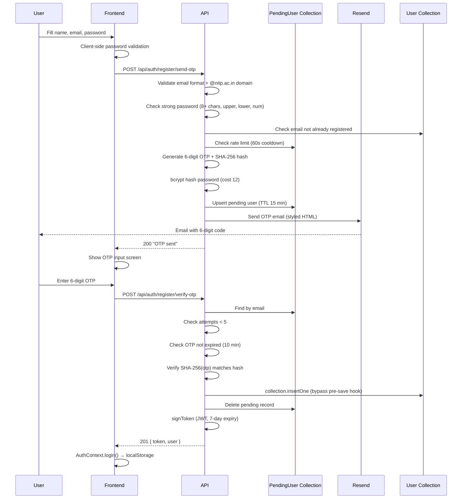

> **Dev mode bypass:** When `RESEND_API_KEY=re_your_api_key_here` (dummy key) and `NODE_ENV=development`, the OTP is printed to the backend terminal instead of being emailed. This allows testing without a real Resend account.

### Password Policy

```
✓ Minimum 8 characters
✓ At least one uppercase letter (A-Z)
✓ At least one lowercase letter (a-z)
✓ At least one number (0-9)
```

Enforced on both **client** (`Register.jsx` real-time validation) and **server** (`isStrongPassword()` in `authRoutes.js`).

### JWT Token Structure

```javascript
jwt.sign({
  id: user._id,
  name: user.name,
  email: user.email,
  role: user.role,          // 'user' or 'admin'
  isAdmin: true/false,
  avatarUrl: user.avatarUrl
}, JWT_SECRET, { expiresIn: '7d' });
```

### Middleware Chain

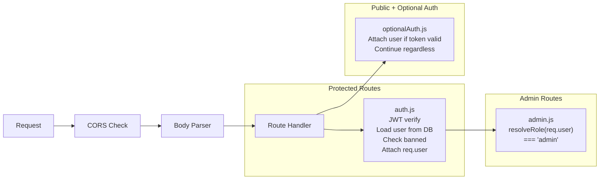

### Admin System

**Dual determination mechanism:**

1. **Config file:** `backend/config/admins.js` — hardcoded email list
2. **Database field:** `User.role === 'admin'`
3. **Resolution:** `resolveRole()` returns `'admin'` if EITHER the role field OR config match

**Admin protections:**
- Admins cannot be banned via API
- Admins cannot be deleted via admin panel
- Admin promotion happens automatically on `User.save()` via pre-save hook

### Authorization Matrix

| Resource | Guest | User | Seller/Owner | Admin |
|----------|-------|------|-------------|-------|
| Browse products | ✅ | ✅ | ✅ | ✅ |
| View product detail | ✅ | ✅ | ✅ | ✅ |
| View announcements | ✅ | ✅ | ✅ | ✅ |
| View item requests | ✅ | ✅ | ✅ | ✅ |
| Create listing | ❌ | ✅ | ✅ | ✅ |
| Edit listing | ❌ | ❌ | ✅ | ✅ |
| Delete listing | ❌ | ❌ | ✅ | ✅ |
| Mark sold/available | ❌ | ❌ | ✅ | ❌ |
| Send messages | ❌ | ✅ | ✅ | ✅ |
| Post comments | ❌ | ✅ | ✅ | ✅ |
| Delete own comments | ❌ | ✅ | ✅ | ✅ |
| Delete any comment | ❌ | ❌ | ❌ | ✅ |
| Wishlist | ❌ | ✅ | ✅ | ✅ |
| Submit feedback | ❌ | ✅ | ✅ | ✅ |
| Mark announcement read | ❌ | ✅ | ✅ | ✅ |
| Manage announcements | ❌ | ❌ | ❌ | ✅ |
| Ban users | ❌ | ❌ | ❌ | ✅ |
| Flag spam | ❌ | ❌ | ❌ | ✅ |
| Delete users | ❌ | ❌ | ❌ | ✅ |
| View admin stats | ❌ | ❌ | ❌ | ✅ |

---

## 7. Backend Deep Dive

### Server Entry (`server.js`)

**Key behaviors:**
1. **DNS override:** `setServers(['1.1.1.1','8.8.8.8'])` — ensures reliable DNS for MongoDB Atlas on certain hosts
2. **CORS strategy:** Allowlist + Vercel preview regex + localhost fallback
3. **Route mounting:** 8 routers on `/api/*` prefixes
4. **Cron job:** Starts daily email digest cron on boot
5. **404 handler:** Catch-all for unmatched routes

### Middleware Details

#### `auth.js` — JWT Authentication
- Extracts `Bearer <token>` from `Authorization` header
- `jwt.verify()` with `JWT_SECRET`
- Loads full user from DB (excludes password)
- Rejects banned users with 403
- Attaches `req.user` (formatted) and `req.userDoc` (Mongoose document)

#### `optionalAuth.js` — Non-Blocking Auth
- Same token extraction, but continues with `next()` if no token
- Used for announcements (guests see list, users get read state)
- Used for item requests (guests see public fields, users see email)

#### `multerUpload.js` — File Upload
- **Memory storage** — files kept in RAM buffers (not written to disk by multer)
- **MIME filter** — only `image/*` accepted
- **Factory function:** `createUpload(maxFiles, maxSizeMb)` — configurable per route
- Product images: 8 files × 5MB each
- Avatar: 1 file × 2MB

### Utility Modules

#### `formatUser.js`
Normalizes user objects for API responses — consistent shape regardless of source:
```javascript
{ id, name, email, role, isAdmin, isBanned, isEmailVerified, phone, avatarUrl, isVerifiedStudent, wishlist }
```

#### `imageStorage.js`
Dual-mode image storage with automatic fallback:

```mermaid
flowchart TD
  UPLOAD[Upload Request] --> CHECK{Cloudinary<br>env vars set?}
  CHECK -->|Yes| CLOUD[Upload to Cloudinary<br>via upload_stream]
  CHECK -->|No| LOCAL[Save to local<br>/uploads/ directory]
  CLOUD --> URL1[https://res.cloudinary.com/...]
  LOCAL --> URL2[/uploads/timestamp-random-name.jpg]
  
  DELETE[Delete Request] --> TYPE{URL type?}
  TYPE -->|Cloudinary| DESTROY[cloudinary.uploader.destroy]
  TYPE -->|Local| UNLINK[fs.unlinkSync]
  TYPE -->|Other| SKIP[Ignore]
```

#### `productImages.js`
- `MAX_PRODUCT_IMAGES = 8`
- `getProductImageList()` — extracts URLs from `imageUrls` array or legacy `imageUrl` field
- `formatProductImages()` — normalizes for API response
- `parseKeepImages()` — parses `keepImages` JSON from edit forms
- `unlinkProductImages()` — deletes all images for a product

#### `resendEmail.js`
Five email template functions:
1. **`sendOtpEmail`** — 6-digit code for signup verification
2. **`sendPasswordResetEmail`** — 6-digit code for password reset
3. **`sendNewMessageEmail`** — "You have a new message" notification
4. **`sendRequestOfferEmail`** — "Someone has your item" notification
5. **`sendDigestEmail`** — Daily summary of pending notifications

All functions include dev-mode fallback (console logging) and HTML sanitization via `escapeHtml()`.

---

## 8. Frontend Deep Dive

### Application Bootstrap

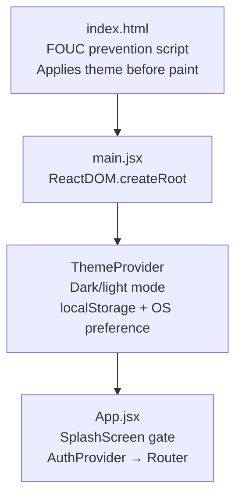

### Context Providers

#### AuthContext
- **State:** `user` object from localStorage (hydrated on load)
- **Actions:** `login(token, user)`, `logout()`, `updateUser(user)`
- **Derived:** `isAuthenticated`, `isAdmin`
- **Auto-refresh:** On mount, calls `GET /auth/me` to sync server state
- **Logout on error:** If `/auth/me` fails (expired/invalid token), auto-logout

#### ThemeContext  
- **State:** `theme` — `'dark'` or `'light'`
- **Detection:** localStorage → OS preference → defaults to `'dark'`
- **Actions:** `setTheme(t)`, `toggleTheme()`
- **Application:** Sets `data-theme` attribute on `<html>` element
- **FOUC prevention:** Inline script in `index.html` applies theme before React renders

### Axios Configuration

```javascript
// Base URL resolution
const env = import.meta.env.VITE_API_URL;
// If empty → '/api' (proxied in dev)
// If 'https://my-api.render.com' → 'https://my-api.render.com/api'
// If 'https://my-api.render.com/api' → unchanged

// Interceptor
- Attaches Bearer token from localStorage
- Removes Content-Type for FormData (lets browser set multipart boundary)
```

### Key Pages

| Page | Route | Auth | Description |
|------|-------|------|-------------|
| Home | `/` | No | Hero, search, category filter, sort, price range, product grid |
| Register | `/register` | No | Two-step: form → OTP (60s resend cooldown) |
| Login | `/login` | No | Email + password → JWT |
| ForgotPassword | `/forgot-password` | No | Three-step: email → OTP → new password |
| ProductDetail | `/product/:id` | No (view) | Gallery, seller card, WhatsApp/Call/Email, chat link, comments |
| SellItem | `/sell` or `/sell/:id` | Yes | Create/edit listing with up to 8 images |
| Dashboard | `/dashboard` | Yes | Seller's own listings with status management |
| Conversations | `/messages` | Yes | Split view inbox with ChatPanel |
| Profile | `/profile` | Yes | Avatar upload, phone, account deletion |
| Wishlist | `/wishlist` | Yes | Saved products grid |
| Requests | `/requests` | Partial | Browse open; auth to post/contact |
| AdminDashboard | `/admin` | Admin | Stats, users, products, spam, bans, announcements, feedback |

### Notable UI Patterns

1. **Optimistic Updates:** Wishlist toggle updates UI immediately, then sends API call
2. **Debounced Search:** 350ms delay on Home page search input
3. **Draft Conversations:** Inbox creates "draft" thread from URL params when no messages exist
4. **Splash Screen:** 3-phase animation (enter → reveal → exit) with aurora/particle effects
5. **Bottom Navigation:** Mobile-only fixed bar with sell FAB button
6. **Read Receipts:** ✓ (sent) / ✓✓ (read) in chat bubbles
7. **Inline URL Detection:** Product descriptions auto-link URLs

---

## 9. API Reference

### Auth Routes (`/api/auth`)

| Method | Endpoint | Auth | Body/Params | Response | Purpose |
|--------|----------|------|-------------|----------|---------|
| POST | `/register/send-otp` | No | `{ name, email, password }` | `{ message, email }` | Initiate OTP signup |
| POST | `/register/verify-otp` | No | `{ email, otp }` | `{ token, user }` | Complete signup |
| POST | `/register/resend-otp` | No | `{ email }` | `{ message }` | Resend OTP (60s cooldown) |
| POST | `/register` | No | `{ name, email, password }` | `{ token, user }` | Legacy direct register |
| POST | `/login` | No | `{ email, password }` | `{ token, user }` | Login |
| POST | `/forgot-password` | No | `{ email }` | `{ message }` | Send reset OTP |
| POST | `/reset-password` | No | `{ email, otp, newPassword }` | `{ message }` | Reset with OTP |
| GET | `/me` | Yes | — | `{ user }` | Get current profile |
| PATCH | `/me` | Yes | FormData: `phone`, `image`, `removeAvatar` | `{ user }` | Update profile |
| DELETE | `/me` | Yes | — | `{ message }` | Delete account + cascade |
| POST | `/wishlist/:productId` | Yes | — | `{ wishlist }` | Add to wishlist |
| DELETE | `/wishlist/:productId` | Yes | — | `{ wishlist }` | Remove from wishlist |

### Product Routes (`/api/products`)

| Method | Endpoint | Auth | Body/Params | Response | Purpose |
|--------|----------|------|-------------|----------|---------|
| GET | `/my/listings` | Yes | — | `[Product]` | Seller's own listings |
| GET | `/` | No | Query: `search`, `category`, `minPrice`, `maxPrice`, `status`, `sortBy` | `[Product]` | Browse with filters |
| GET | `/:id` | No | — | `Product` | Single product detail |
| POST | `/` | Yes | FormData: fields + `images[]` | `Product` | Create listing |
| PUT | `/:id` | Yes | FormData: fields + `images[]` + `keepImages` | `Product` | Edit listing |
| PATCH | `/:id/status` | Yes | `{ status }` | `Product` | Toggle available/sold |
| DELETE | `/:id` | Yes | — | `{ message }` | Delete listing + images |

### Message Routes (`/api/messages`)

| Method | Endpoint | Auth | Purpose |
|--------|----------|------|---------|
| GET | `/unread-count` | Yes | Count of unread messages |
| GET | `/conversations` | Yes | Grouped conversation list |
| GET | `/:productId/:otherUserId` | Yes | Thread messages (product) |
| GET | `/request/:requestId/:otherUserId` | Yes | Thread messages (request) |
| POST | `/` | Yes | Send message (with notification queue) |

### Admin Routes (`/api/admin`) — All require auth + admin

| Method | Endpoint | Purpose |
|--------|----------|---------|
| GET | `/stats` | Dashboard counts (users, products, comments, spam, banned, openFeedback) |
| GET | `/users` | List all users |
| GET | `/products` | List all products (including spam) |
| DELETE | `/products/:id` | Delete product + comments + messages |
| PATCH | `/products/:id/spam` | Toggle spam flag |
| DELETE | `/comments/:id` | Delete any comment |
| PATCH | `/users/:id/ban` | Toggle user ban |
| DELETE | `/users/:id` | Delete user + all data |
| GET/POST/PATCH/DELETE | `/announcements[/:id]` | Full CRUD on announcements |
| GET/PATCH/DELETE | `/feedback[/:id]` | View + manage user feedback |

### Other Routes

| Prefix | Method | Endpoint | Auth | Purpose |
|--------|--------|----------|------|---------|
| `/api/announcements` | GET | `/` | Optional | List active announcements |
| `/api/announcements` | GET | `/unread-count` | Yes | Unread announcement count |
| `/api/announcements` | POST | `/read-all` | Yes | Mark all as read |
| `/api/announcements` | POST | `/:id/read` | Yes | Mark one as read |
| `/api/comments` | GET | `/product/:productId` | No | Get product comments |
| `/api/comments` | POST | `/product/:productId` | Yes | Add comment |
| `/api/comments` | DELETE | `/:id` | Yes | Delete (owner or admin) |
| `/api/feedback` | POST | `/` | Yes | Submit feedback |
| `/api/requests` | GET | `/` | Optional | List item requests |
| `/api/requests` | POST | `/` | Yes | Create item request |
| `/api/requests` | GET | `/:id` | Optional | Get single request |
| `/api/requests` | POST | `/:id/contact` | Yes | "I have this" flow |
| `/api/requests` | DELETE | `/:id` | Yes | Delete (owner or admin) |
| `/api/requests` | PATCH | `/:id/status` | Yes | Mark fulfilled/open |

---

## 10. Feature Walkthroughs

### Multi-Image Product Listing (Create)

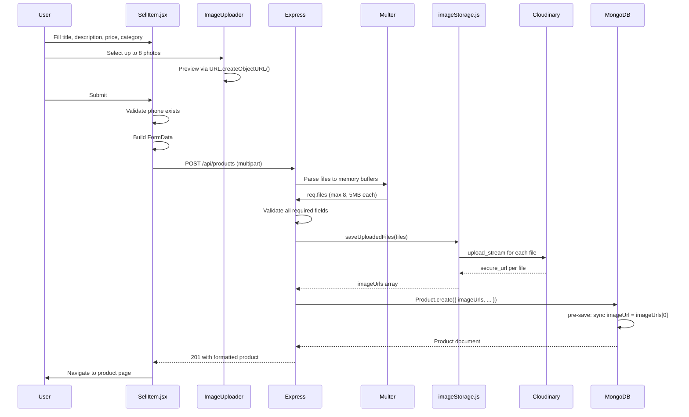

### Multi-Image Product Listing (Edit)

The edit flow involves a sophisticated image reconciliation:

1. Frontend sends `keepImages` (JSON array of existing URLs to retain) + new `images[]` files
2. Backend merges: `nextImages = [...parseKeepImages(body), ...saveUploadedFiles(files)]`
3. Calculates removed: `previousImages.filter(url => !nextImages.includes(url))`
4. Deletes removed images from Cloudinary/disk
5. Validates at least 1 and at most 8 images total

### Item Request → Contact → Chat Flow

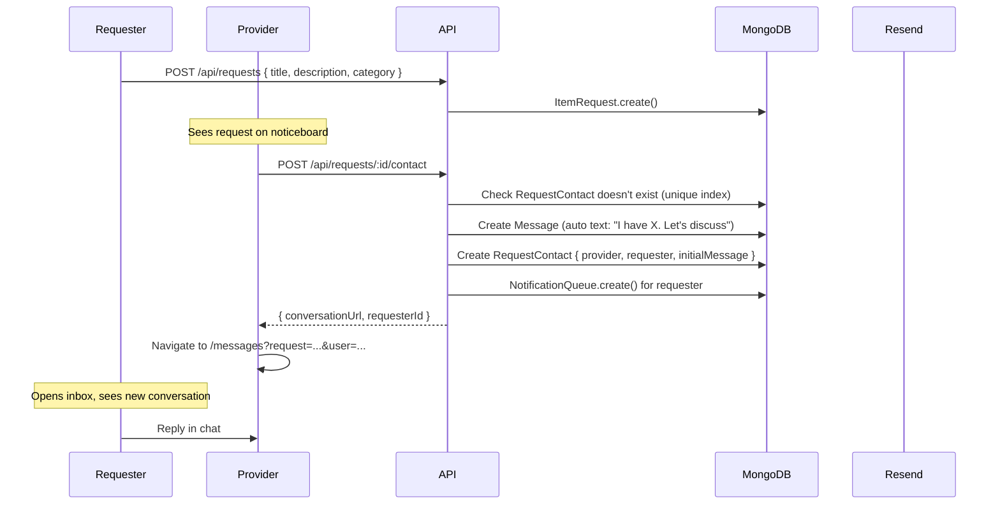

### Optimistic Wishlist

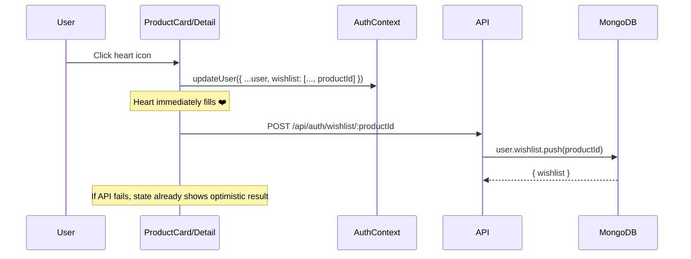

### Password Reset Flow

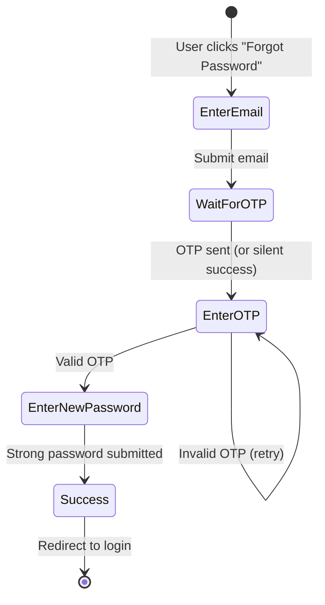

Anti-enumeration: Always returns "If an account exists, a code has been sent" regardless of whether the email exists.

---

## 11. Image Storage System

### Architecture Decision

The image system uses a **Strategy Pattern** with automatic fallback:

```mermaid
flowchart TD
  START[Image Upload] --> ENV{CLOUDINARY_*<br>env vars set?}
  ENV -->|All 3 present| INIT[initCloudinary<br>Lazy, one-time]
  INIT --> STREAM[upload_stream<br>Buffer → Cloudinary]
  STREAM --> CDN_URL[https://res.cloudinary.com/...]
  
  ENV -->|Missing any| LOCAL[saveToLocalDisk<br>Buffer → /uploads/]
  LOCAL --> DISK_URL[/uploads/timestamp-random-name.ext]
  
  DELETE[Delete Image] --> DETECT{URL contains<br>res.cloudinary.com?}
  DETECT -->|Yes| EXTRACT[Extract public_id<br>from URL path]
  EXTRACT --> DESTROY[cloudinary.uploader.destroy]
  DETECT -->|No| CHECK{Starts with<br>/uploads/?}
  CHECK -->|Yes| FS_DELETE[fs.unlinkSync]
  CHECK -->|No| NOOP[Skip]
```

### Why Dual Mode?

| Scenario | Mode | Benefit |
|----------|------|---------|
| Local development | Local disk | No Cloudinary account needed |
| Production (Render) | Cloudinary | Persistent URLs survive redeploys |
| CI/Testing | Local disk | Fast, no network dependency |

> **WARNING:** Render's ephemeral filesystem deletes local `/uploads/` on every redeploy. Cloudinary is **required** for production persistence.

---

## 12. Chat & Messaging System

### Architecture: HTTP Polling

This project deliberately uses **HTTP polling** instead of WebSockets:

| Component | Poll Interval | Endpoint |
|-----------|--------------|----------|
| ChatPanel (active thread) | 15 seconds | `GET /messages/:productId/:otherUserId` |
| Navbar (unread badge) | 10 seconds | `GET /messages/unread-count` |
| BottomNav (unread badge) | 10 seconds | `GET /messages/unread-count` |
| Conversations list | 30 seconds | `GET /messages/conversations` |

### Conversation Grouping

The `/messages/conversations` endpoint groups all messages by `(contextType, contextId, otherUserId)`:

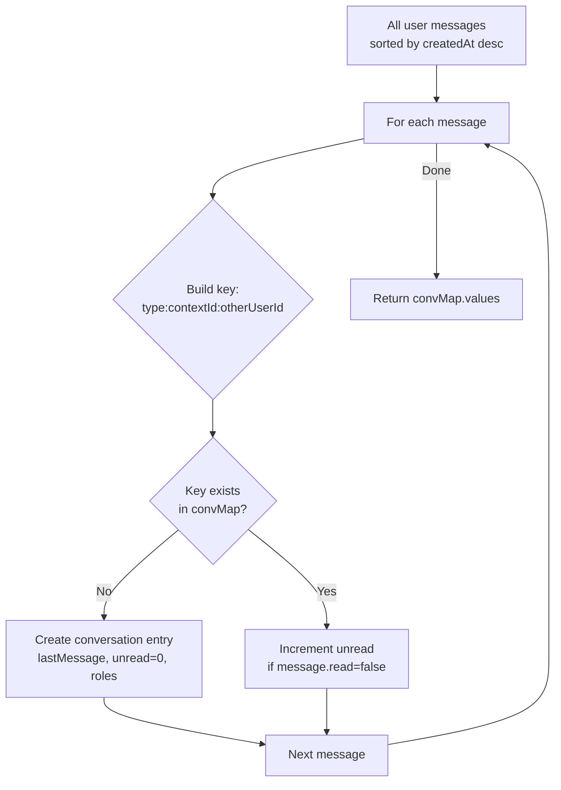

### Message Threading Rules

**Product messages:**
- Only the seller and a buyer can initiate a thread
- Once a thread exists, both parties can continue

**Request messages:**
- Only a provider can initiate (via "I have this" contact flow)
- Requester can only reply to existing threads

### Read Receipts

- Messages marked `read: true` when recipient opens the thread
- `updateMany` on thread messages from the other user
- UI shows ✓ (sent, unread) or ✓✓ (read) per message bubble

### Notification Pipeline

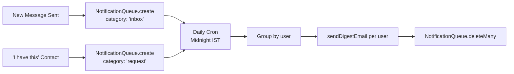

---

## 13. Email Notification System

### Email Types

| Email | Trigger | Template |
|-------|---------|----------|
| **OTP Verification** | `POST /auth/register/send-otp` | Branded HTML with large OTP code |
| **Password Reset** | `POST /auth/forgot-password` | Branded HTML with reset code |
| **New Message** | Available but not directly triggered (via digest) | Product-specific CTA |
| **Request Offer** | Available but not directly triggered (via digest) | "Someone has your item" |
| **Daily Digest** | Cron at midnight IST | Summary: X inbox messages, Y offers |

### Dev Mode Behavior

All email functions check for the dummy API key `re_your_api_key_here`:
- If **dummy + development:** Log to terminal, return `{ success: true }`
- If **dummy + production:** Return `{ success: false, error: 'not configured' }`
- If **real key:** Send via Resend API

### Cron Job (`emailDigestCron.js`)

- **Schedule:** `0 0 * * *` (midnight daily) in `Asia/Kolkata` timezone
- **Process:** Reads all `NotificationQueue` entries → groups by user → sends one email per user → clears queue
- **Bundling:** Counts inbox messages and request offers separately in the email body

---

## 14. Security Analysis

### Current Protections

| Protection | Implementation | Location |
|-----------|---------------|----------|
| Password hashing | bcrypt, cost factor 12 | `User.js` pre-save hook |
| OTP hashing | SHA-256 (not plaintext in DB) | `authRoutes.js` |
| OTP rate limiting | 60s cooldown between sends | `authRoutes.js`, `PendingUser.lastSentAt` |
| OTP attempt limiting | Max 5 failed attempts | `authRoutes.js` |
| OTP expiry | 10 minutes | `PendingUser.otpExpires` |
| Auto-cleanup | PendingUser TTL 15 min | MongoDB TTL index |
| JWT authentication | Verified on every protected route | `middleware/auth.js` |
| Banned user blocking | Checked at auth middleware level | `auth.js` line 17 |
| CORS restriction | Allowlist + Vercel regex + localhost | `server.js` |
| File type restriction | MIME check (image/* only) | `multerUpload.js` |
| File size limit | 5MB per product image, 2MB avatar | `multerUpload.js` |
| XSS in emails | `escapeHtml()` on all user data | `resendEmail.js` |
| Seller authorization | `product.seller === req.user.id` check | `productRoutes.js` |
| Admin protection | Cannot ban/delete admin accounts | `adminRoutes.js` |
| Email enumeration prevention | Consistent response for forgot-password | `authRoutes.js` |
| Self-messaging prevention | `senderId === recvId` check | `messageRoutes.js` |
| Duplicate contact prevention | Unique index on `{ itemRequest, provider }` | `RequestContact.js` |
| Indian phone validation | Regex `/^(\+91)?[6-9]\d{9}$/` | `authRoutes.js` |
| Domain restriction | Only `@nitp.ac.in` + admin emails can register | `authRoutes.js` |

### Known Gaps & Mitigations

| Risk | Current State | Recommended Mitigation |
|------|--------------|----------------------|
| JWT in localStorage | Accessible to XSS | httpOnly cookies + CSRF token |
| No rate limiting on APIs | Unlimited requests | `express-rate-limit` middleware |
| MongoDB regex search | Possible ReDoS with crafted input | Text index or sanitize regex |
| Admin emails in source code | Visible in repository | Move to environment variables |
| No CSRF protection | Stateless JWT (partial mitigation) | SameSite cookies if moving to cookies |
| No Content Security Policy | Missing CSP headers | Helmet.js middleware |
| No audit logging | No record of admin actions | Audit trail collection |
| Account deletion non-transactional | Multiple `deleteMany` without transaction | Mongoose transactions |
| No virus scanning on uploads | MIME check only | ClamAV or cloud scanning service |

---

## 15. Deployment Guide

### Architecture Overview

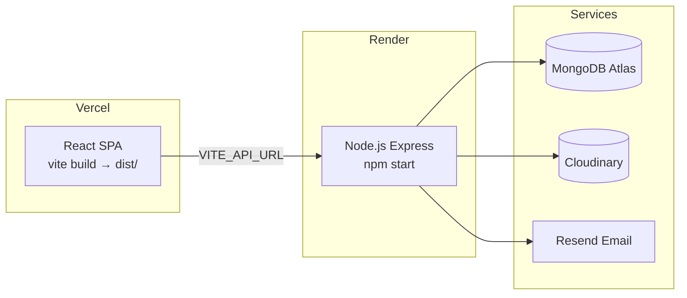

### Frontend (Vercel)

1. Import the `frontend/` directory as a Vercel project
2. Set environment variable: `VITE_API_URL=https://your-backend.onrender.com`
3. Build command: `npm run build`
4. Output directory: `dist`
5. `vercel.json` handles SPA routing: `{ "rewrites": [{ "source": "/(.*)", "destination": "/index.html" }] }`

### Backend (Render)

1. Create a new Web Service from the `backend/` directory
2. Build command: `npm install`
3. Start command: `npm start`
4. Set environment variables (minimum):

```env
PORT=5000
MONGO_URI=mongodb+srv://...
JWT_SECRET=<64+ character random string>
FRONTEND_URL=https://your-frontend.vercel.app
CLOUDINARY_CLOUD_NAME=your_cloud_name
CLOUDINARY_API_KEY=your_api_key
CLOUDINARY_API_SECRET=your_api_secret
RESEND_API_KEY=re_your_real_key
RESEND_FROM_EMAIL=noreply@yourdomain.com
NODE_ENV=production
```

### Local Development

```bash
# Terminal 1 — Backend
cd backend
cp .env.example .env  # Fill in MONGO_URI, JWT_SECRET
npm install
npm run dev            # http://localhost:5000

# Terminal 2 — Frontend
cd frontend
npm install
npm run dev            # http://localhost:3000 (proxies /api → :5000)
```

> **OTP testing locally:** Leave `RESEND_API_KEY=re_your_api_key_here` in `.env`. The OTP will be printed to the backend terminal.

---

## 16. Performance & Scalability

### Current Bottlenecks

| Bottleneck | Impact | Severity |
|-----------|--------|----------|
| MongoDB `$regex` search on title | Collection scan (no text index) | 🟡 Medium |
| HTTP polling (10–30s intervals) | N users × interval = high read load | 🟡 Medium |
| Single Node.js process | CPU/memory ceiling on free tier | 🟠 High (at scale) |
| No response caching | Every request hits MongoDB | 🟡 Medium |
| Full message load for conversations | Loads ALL user messages to group | 🟠 High |
| No pagination on product listing | Loads all matching products | 🟡 Medium |

### Scaling Strategy (1M Users)

| Layer | Current | Scaled |
|-------|---------|--------|
| **Search** | MongoDB $regex | Atlas Search or Elasticsearch |
| **Chat** | HTTP polling (15s) | WebSockets (Socket.io) with rooms |
| **Cache** | None | Redis for unread counts, sessions |
| **API** | Single instance | Horizontal scaling + load balancer |
| **Frontend** | Vercel CDN | Already good ✅ |
| **Auth** | JWT in localStorage | httpOnly cookies + refresh tokens |
| **Images** | Cloudinary | Already CDN ✅ |
| **Email** | Inline sends | Message queue (Bull/BullMQ) |
| **Database** | Single Atlas instance | Read replicas + sharding |
| **Monitoring** | Console.log | Sentry + structured logging |

---

## 17. What This Project Does NOT Include

> **Be honest in interviews.** Never claim features that don't exist.

| Topic | Status | Notes |
|-------|--------|-------|
| LLM / ChatGPT / AI features | ❌ Not implemented | Could add listing description suggestions |
| RAG / embeddings / vector DB | ❌ Not implemented | Could add semantic search |
| WebSockets / Socket.io | ❌ Not implemented | Uses HTTP polling by design |
| Payment gateway (Razorpay/Stripe) | ❌ Not implemented | Trades happen offline |
| TypeScript | ❌ Not used | JavaScript throughout |
| Redux / Zustand | ❌ Not used | Context API only |
| Redis | ❌ Not used | Stateless JWT design |
| Automated tests (Jest/Cypress) | ❌ Not found | Manual testing only |
| CI/CD pipeline | ❌ Not in repo | May exist externally |
| Server-Side Rendering | ❌ Not used | SPA architecture |
| GraphQL | ❌ Not used | REST API |
| Docker | ❌ Not configured | Direct Node.js deployment |
| Microservices | ❌ Monolithic | Appropriate for current scale |

---

## 18. Design Decisions & Trade-offs

### Polling vs WebSockets

| Polling (Chosen) | WebSockets |
|-----------------|------------|
| ✅ REST only, stateless | ❌ Persistent connections |
| ✅ Works with any hosting | ❌ Needs sticky sessions |
| ✅ Simple implementation | ❌ More complex architecture |
| ❌ 10–15s message latency | ✅ Sub-second delivery |
| ❌ Higher HTTP overhead | ✅ Efficient for frequent updates |

**Interview line:** "We chose polling for simplicity and compatibility with stateless hosting. The 10-15s latency is acceptable for a campus marketplace where urgency is low."

### JWT in localStorage vs httpOnly Cookies

| localStorage (Chosen) | httpOnly Cookies |
|----------------------|-----------------|
| ✅ Simple SPA implementation | ❌ Needs CSRF protection |
| ✅ No cookie configuration | ✅ Not accessible via JavaScript |
| ❌ Vulnerable to XSS | ✅ Immune to XSS token theft |
| ✅ Works cross-origin easily | ❌ Complex with cross-origin |

### MongoDB vs PostgreSQL

| MongoDB (Chosen) | PostgreSQL |
|-----------------|------------|
| ✅ Document model fits listings | ✅ Strict schema, ACID |
| ✅ `imageUrls` arrays native | ❌ Arrays less natural |
| ✅ `populate()` for joins | ✅ SQL JOINs more powerful |
| ✅ Mongoose ODM for MERN | ❌ Different ORM ecosystem |

### Context API vs Redux

| Context (Chosen) | Redux |
|-----------------|-------|
| ✅ Only auth is truly global | ❌ Overhead for simple state |
| ✅ Built into React | ❌ Additional dependency |
| ✅ Minimal boilerplate | ✅ DevTools, middleware |
| ❌ Re-renders all consumers | ✅ Selective subscriptions |

### Monolith vs Microservices

| Monolith (Chosen) | Microservices |
|-------------------|--------------|
| ✅ Single deployable | ❌ Multiple services to manage |
| ✅ Simple debugging | ❌ Distributed tracing needed |
| ✅ Appropriate for team size | ✅ Independent scaling |

---

## 19. Problems Faced & Solutions

### 1. Images Replaced by Random Stock Photos

- **Problem:** Listing photos changed to unrelated images after server redeployment
- **Root cause:** (a) Render's ephemeral disk deleted `/uploads/` on redeploy; (b) frontend `onError` handler fell back to `picsum.photos` random images
- **Solution:** 
  - Integrated Cloudinary for persistent image storage
  - Replaced random fallback with neutral SVG placeholder
  - Added `isLegacyRandomPlaceholder()` check to filter old picsum URLs
- **Lesson:** Never use random URL fallbacks for user content; use cloud storage in production

### 2. Profile Picture Not Persisting After Logout

- **Problem:** Avatar appeared during session but was gone after re-login
- **Root cause:** Axios interceptor set `Content-Type: multipart/form-data` without the boundary parameter — Multer couldn't parse the upload
- **Solution:** 
  - Delete `Content-Type` header for `FormData` in interceptor (let browser set boundary)
  - Added `GET /auth/me` refresh on AuthContext mount
- **Lesson:** Let the browser set multipart Content-Type boundaries

### 3. "Chat with Seller" Opened Empty Inbox

- **Problem:** Clicking "Chat with Seller" showed "No messages yet" with no way to compose
- **Root cause:** `Conversations.jsx` only selected threads that already existed in the conversation list
- **Solution:** 
  - Added "draft conversation" system: `buildDraftFromProduct()` / `buildDraftFromRequest()`
  - URL params `?product=X&user=Y` bootstrap a draft thread with ChatPanel
  - Draft merges into conversation list after first message
- **Lesson:** Deep-link flows need UI state for the "zero messages" case

### 4. MongoDB Connection Failures (DNS on Render)

- **Problem:** Backend couldn't connect to MongoDB Atlas on certain Render instances
- **Root cause:** Default DNS resolvers on some cloud hosts fail to resolve `mongodb+srv://` SRV records
- **Solution:** Added `require("node:dns/promises").setServers(["1.1.1.1","8.8.8.8"])` at the top of `server.js`
- **Lesson:** Cloud hosting DNS can be unreliable; hardcode reliable resolvers for SRV records

### 5. Express Route Order Bug

- **Problem:** `GET /api/products/my/listings` returned 500 (CastError)
- **Root cause:** `/:id` route was registered before `/my/listings`, so Express tried to parse "my" as a MongoDB ObjectId
- **Solution:** Register specific routes (`/my/listings`) before parameterized routes (`/:id`)
- **Lesson:** Express matches routes in registration order — always put specific paths first

### 6. FOUC (Flash of Unstyled Content) on Theme

- **Problem:** Page briefly flashed in wrong theme before React hydrated
- **Root cause:** React only sets `data-theme` after mount, but the initial render uses the HTML default
- **Solution:** Inline `<script>` in `index.html` reads localStorage and applies `data-theme` before paint
- **Lesson:** Pre-React scripts solve render-blocking UI state issues

---

## 20. Interview Preparation (Exhaustive)

### Quick Reference Card

| Item | Answer |
|------|--------|
| **Project name** | NIT Patna Market / Campus Market |
| **Type** | Full-stack MERN marketplace SPA |
| **Target users** | NIT Patna students (`@nitp.ac.in`) + configured admins |
| **Frontend** | React 18, Vite 8, React Router 6, Axios, vanilla CSS |
| **Backend** | Node.js, Express 4, Mongoose 8 |
| **Database** | MongoDB (Atlas in production) |
| **Auth** | JWT (7-day), bcrypt (cost 12), OTP via Resend |
| **Images** | Multer → Cloudinary CDN (with local fallback) |
| **Real-time** | HTTP polling (NOT WebSockets) |
| **Deployment** | Frontend: Vercel / Backend: Render |
| **Mobile** | PWA (installable) |
| **What it does NOT have** | AI/LLM, WebSockets, payments, TypeScript, Redux, tests |

### 30-Second Pitch

> "NIT Patna Market is a MERN campus marketplace where verified NIT Patna students list and buy second-hand items. It features OTP-verified signup, a Verified Student badge, multi-image listings on Cloudinary CDN, buyer–seller chat with polling, an item requests noticeboard, optimistic wishlist, daily email digests, and admin moderation — deployed as a PWA on Vercel and Render."

### 2-Minute Pitch (Expand With)

- **Architecture:** React SPA on Vercel, REST API on Render, MongoDB Atlas
- **Security:** bcrypt passwords, JWT protected routes, seller-only edit/delete, admin middleware chain, OTP hashing
- **UX highlights:** Dark glassmorphism UI, inbox split view, draft conversations, read receipts, splash screen animation
- **Trade-off:** Polling over WebSockets for simpler deployment and stateless scaling
- **Notification system:** NotificationQueue → daily cron → batched digest emails

---

### Section A: Beginner Questions (1-25)

| # | Question | Answer |
|---|----------|--------|
| 1 | What is this project? | A campus marketplace MERN app for NIT Patna students to buy/sell used items |
| 2 | What stack do you use? | MongoDB, Express, React, Node.js + JWT, bcrypt, Multer, Cloudinary, Resend |
| 3 | Who can use this? | Students with `@nitp.ac.in` email + 3 configured admin emails |
| 4 | How do users register? | `POST /api/auth/register/send-otp` → OTP email → `verify-otp` → JWT + user |
| 5 | How do users login? | `POST /api/auth/login` → bcrypt compare → JWT (7-day expiry) |
| 6 | Where is the JWT stored? | `localStorage` (token key + user JSON) |
| 7 | What is a REST API? | Resource-based HTTP API using GET/POST/PUT/PATCH/DELETE, stateless |
| 8 | What is MongoDB? | Document-oriented NoSQL database storing JSON-like documents |
| 9 | What is Mongoose? | ODM for MongoDB — provides schemas, validation, hooks, and populate() |
| 10 | What is React? | Component-based UI library for building SPAs with virtual DOM |
| 11 | What is Vite? | Next-gen build tool — fast HMR, ES module dev server, Rollup bundler |
| 12 | What is Axios? | Promise-based HTTP client with interceptors (used for JWT attachment) |
| 13 | What is JWT? | JSON Web Token — signed payload for stateless authentication |
| 14 | Why hash passwords? | bcrypt in User pre-save hook, cost factor 12, only when `isModified('password')` |
| 15 | What is CORS? | Cross-Origin Resource Sharing — server controls which origins can call API |
| 16 | What is Multer? | Express middleware for handling `multipart/form-data` (file uploads) |
| 17 | What is Cloudinary? | Cloud image CDN — persistent hosting with transformations and optimization |
| 18 | How many photos per listing? | Up to 8 (`MAX_PRODUCT_IMAGES` in `productImages.js`) |
| 19 | What categories exist? | Books, Electronics, Clothing, Furniture, Stationery, Sports, Other |
| 20 | Can guests browse? | Yes — auth needed for selling, chatting, commenting, wishlisting, feedback |
| 21 | What is the admin dashboard? | Stats, user management, product moderation, announcements CRUD, feedback inbox |
| 22 | What is `populate()`? | Mongoose method replacing ObjectId references with full documents (like SQL JOIN) |
| 23 | What is a SPA? | Single Page Application — one HTML file, client-side routing |
| 24 | What is the PWA support? | `manifest.json` + `<link rel="manifest">` enables mobile installation |
| 25 | What is the verified student badge? | 🎓 shown for users with `@nitp.ac.in` email (`isVerifiedStudent: true`) |

### Section B: Intermediate Questions (26-60)

| # | Question | Answer |
|---|----------|--------|
| 26 | Explain the full authentication flow | Register → send OTP → verify OTP → create User → sign JWT → store in localStorage → Axios interceptor attaches Bearer token → auth middleware verifies on every protected request |
| 27 | How does the admin system work? | Dual: `config/admins.js` email list + `User.role` field. `resolveRole()` checks both. Pre-save hook auto-promotes matching emails. Admin middleware checks after auth middleware |
| 28 | How does chat work technically? | POST creates Message doc (product or request context). GET retrieves thread. Frontend polls every 15s. Conversations grouped by `(contextType, contextId, otherUserId)` |
| 29 | Why are there two polling intervals? | ChatPanel: 15s (active conversation, less frequent). Navbar unread badge: 10s (quick awareness) |
| 30 | How are conversations grouped? | `messageRoutes.js` builds a Map with key `type:contextId:otherUserId`, tracking lastMessage, unread count, and participant roles |
| 31 | How are unread counts computed? | `Message.countDocuments({ receiver: userId, read: false })` — uses compound index |
| 32 | How are messages marked as read? | `updateMany` when recipient opens a thread — marks all messages from other user as `read: true` |
| 33 | Can you message yourself? | No — `senderId === recvId` check returns 400 |
| 34 | Explain the multi-image edit flow | Frontend sends `keepImages` JSON + new files. Backend: `nextImages = keep + new`. Removes `previous - next` from Cloudinary. Validates 1-8 total |
| 35 | How does the image fallback work? | `getStorageMode()` checks if Cloudinary env vars exist → uses Cloudinary or local disk. Frontend uses `resolveProductImageSrc()` → SVG placeholder if missing |
| 36 | Why is `GET /my/listings` before `GET /:id`? | Express matches routes in order. If `/:id` came first, "my" would be treated as an ObjectId → CastError |
| 37 | What is `optionalAuth` middleware? | Attaches user if valid token exists, but continues regardless. Used for announcements (read state) and requests (contact info visibility) |
| 38 | How does the NotificationBell work? | Fetches `/api/announcements` + `/api/announcements/unread-count`. Dropdown panel with mark-read. Polls every 60s. Click-outside and Escape to close |
| 39 | How does `ProtectedRoute` work? | Checks `useAuth().isAuthenticated` → renders children if true, else `<Navigate to="/login">` |
| 40 | How does `AdminRoute` work? | Checks `useAuth().isAdmin` → renders children or redirects to home |
| 41 | Explain the product spam system | Admin sets `isSpam: true` on product → `GET /api/products` filters with `{ isSpam: false }` → product hidden from browse but not deleted |
| 42 | How does WhatsApp deep linking work? | Strips non-numeric chars from phone, opens `https://wa.me/{phone}?text={encoded message}` in new tab |
| 43 | Explain the avatar upload flow | `PATCH /api/auth/me` with multipart → `multer` (1 file, 2MB) → delete old avatar from Cloudinary → upload new → save URL to user |
| 44 | How does account deletion cascade? | Deletes: avatar image, all products (+ their images), all comments, all messages (sent/received), all item requests, all request contacts, then the user document |
| 45 | How does the Vite proxy work? | `vite.config.js` proxies `/api` → `http://localhost:5000` and `/uploads` → same. Only active in dev mode |
| 46 | Why delete Content-Type for FormData? | Browser must set multipart boundary parameter. Manual Content-Type breaks Multer parsing |
| 47 | How does the feedback system work? | User submits via `FeedbackSection` on homepage → `POST /api/feedback` → admin sees in dashboard with status workflow: open → read → resolved |
| 48 | How does the announcement read system work? | `AnnouncementRead` collection with `{ user, announcement }` unique compound index. `upsert: true` prevents race conditions |
| 49 | What is the `formatProductImages` utility? | Normalizes product objects: extracts `imageUrls` array from either `imageUrls` or legacy `imageUrl` field, ensures consistent response shape |
| 50 | How does debounced search work? | `Home.jsx` wraps `fetchProducts` in 350ms `setTimeout`. Cleanup function clears timeout on dependency change. Prevents rapid API calls while typing |
| 51 | What is the splash screen? | Three-phase CSS animation: enter (0-400ms) → reveal (400-2200ms) → exit (2200-2800ms). Particles, aurora gradient, NIT Patna logo. Only shows once per session (sessionStorage) |
| 52 | How does the theme system prevent FOUC? | Inline script in `index.html` reads localStorage before React renders. Sets `data-theme` attribute immediately |
| 53 | How does the `mediaUrl()` utility work? | If URL is absolute (http/blob/data), returns as-is. Otherwise prepends API root. Handles both local `/uploads/` paths and full Cloudinary URLs |
| 54 | What is the email enumeration prevention? | `forgot-password` always returns "If an account with that email exists, a code has been sent" — even if email doesn't exist or user is banned |
| 55 | How does the daily digest cron work? | `node-cron` at midnight IST → reads NotificationQueue → groups by user → sends one digest email per user → clears queue |
| 56 | What is the `RequestContact` model for? | Tracks who clicked "I have this" on an item request. Unique index prevents duplicate contacts. Stores reference to auto-generated initial message |
| 57 | How does the "I have this" contact flow work? | Creates RequestContact → auto-generates Message → adds to NotificationQueue → returns conversation URL for redirect |
| 58 | What is the `PendingUser` TTL? | MongoDB TTL index on `createdAt` with 900s (15 minutes). Auto-deletes abandoned signup attempts |
| 59 | How is the OTP secured? | SHA-256 hashed before storage (not plaintext in DB). 10-min expiry. Max 5 attempts before auto-deletion. 60s cooldown between sends |
| 60 | What is `resolveRole()` vs `user.role`? | `resolveRole()` checks both the database `role` field AND the `config/admins.js` email list. A user could have `role: 'user'` but still be admin if their email is in the allowlist |

### Section C: Advanced & System Design Questions (61-100)

| # | Question | Answer |
|---|----------|--------|
| 61 | What are the trade-offs of JWT in localStorage? | Pro: Simple SPA auth, stateless. Con: XSS can steal token. Mitigation: 7-day expiry, move to httpOnly cookies for production |
| 62 | How would you scale this to 100K users? | Atlas text index for search, WebSocket for chat, Redis for caching unread counts, horizontal API scaling, CDN for frontend |
| 63 | How would you fix slow search? | MongoDB text index on title+description, or integrate Atlas Search / Elasticsearch for fuzzy matching |
| 64 | How would you prevent API abuse? | `express-rate-limit` on auth endpoints, CAPTCHA on registration, request throttling per IP |
| 65 | Describe IDOR risks in this project | Product edit/delete checks `product.seller === req.user.id`. Message send validates conversation context. Request delete checks ownership. Admin routes have middleware |
| 66 | Why is horizontal scaling easy with JWT? | Stateless — any server instance with the same `JWT_SECRET` can verify tokens. No session store synchronization needed |
| 67 | Would you need sticky sessions? | Not for current REST API. Yes if WebSockets added (Socket.io needs connection affinity, or use Redis adapter) |
| 68 | How would you migrate local images to Cloudinary? | Write migration script: scan `/uploads/`, upload each to Cloudinary, update MongoDB `imageUrls` with new URLs |
| 69 | Explain eventual consistency in the chat system | Polling has 10-15s window where messages exist in DB but aren't visible to recipient. Not truly eventually consistent — it's periodic polling |
| 70 | Where is optimistic UI used? | Wishlist: updates `AuthContext.user.wishlist` immediately, then fires API call. If API fails, state remains optimistic (no rollback) |
| 71 | What database indexes exist? | Message: 3 compound indexes. Comment: product+createdAt. Announcement: active+createdAt. AnnouncementRead: user+announcement unique. Feedback: status+createdAt. RequestContact: itemRequest+provider unique + requester |
| 72 | Why isn't account deletion transactional? | Uses parallel `Promise.all` deletes without MongoDB transaction. Risk: partial deletion if one operation fails. Fix: wrap in `session.withTransaction()` |
| 73 | How would you add payment escrow? | New PaymentTransaction model, integrate Razorpay/Stripe webhooks, escrow state machine (initiated → paid → delivered → released), buyer protection window |
| 74 | Compare WebSocket upgrade path | Socket.io with room-per-thread (`room: product:${id}:${userId}`). Store messages in MongoDB, emit to room. Redis adapter for multi-instance |
| 75 | Why bcrypt cost factor 12? | Balances security vs latency. At 12, hashing takes ~300ms — acceptable for registration but slow enough to resist brute force |
| 76 | Could you add refresh tokens? | Yes: short-lived access JWT (15 min) + long-lived refresh token in httpOnly cookie. Refresh endpoint issues new access token |
| 77 | Why not SSR for SEO on listings? | SPA design choice. Product pages are dynamic, not content-heavy for SEO. Could add Next.js for SSR/ISR if SEO becomes important |
| 78 | How would you add monitoring? | Sentry for error tracking, structured logging (Winston/Pino), health check endpoint, MongoDB Atlas monitoring, Render metrics |
| 79 | What load test bottlenecks would appear? | 1) MongoDB regex search without index. 2) Polling creating read amplification. 3) Image upload memory pressure. 4) Single process thread blocking |
| 80 | Explain CAP theorem for this system | MongoDB: CP in replica set mode (consistency over availability during partition). Our polling chat is AP-like (available but potentially stale) |
| 81 | Why not GraphQL? | REST sufficient for the feature set. Simpler mental model for MERN learning project. No complex nested query needs |
| 82 | When would microservices make sense? | If image processing, chat, and notifications need independent scaling. Current monolith is appropriate for team size and feature scope |
| 83 | How does the announcement read race condition work? | `findOneAndUpdate` with `upsert: true` on unique compound index. If two requests arrive simultaneously, one upserts and the other updates (idempotent) |
| 84 | Explain the DNS workaround in server.js | `require("node:dns/promises").setServers(["1.1.1.1","8.8.8.8"])` — overrides system DNS for reliable SRV record resolution on Render |
| 85 | How would you implement real-time notifications? | FCM (Firebase Cloud Messaging) for push, WebSocket for in-app. Notification preferences per user. Queue system (Bull) for reliability |
| 86 | Describe the Message model validation | Pre-validate hook: must have exactly one of `product` or `itemRequest` (XOR). Prevents orphan messages and dual-context bugs |
| 87 | How does the conversation draft system work? | URL params `?product=X&user=Y` → fetch product → `buildDraftFromProduct()` creates synthetic conversation object → ChatPanel renders empty thread with composer |
| 88 | What is the Product pre-save imageUrl sync? | `imageUrl = imageUrls[0]` — backward compatibility with older code that used single image. Runs on every save |
| 89 | How would you implement content moderation at scale? | ML classification service (OpenAI moderation API), auto-flag + review queue, user reporting system, word filters |
| 90 | Explain the CORS configuration strategy | Set of hardcoded origins + dynamic FRONTEND_URL + regex for Vercel preview deployments (`/^https:\/\/[\w-]+-[\w-]+\.vercel\.app$/`) + all localhost ports |

### Section D: "Why" Questions (91-110)

| # | Question | Answer |
|---|----------|--------|
| 91 | Why MERN over Next.js full-stack? | Separate SPA + API for independent deployment on Vercel + Render. Simpler mental model for learning |
| 92 | Why Resend over NodeMailer/Gmail SMTP? | Modern API-first email service. Better deliverability than Gmail SMTP. Cleaner integration (SDK). Free tier sufficient |
| 93 | Why memory storage in Multer? | Files stream directly to Cloudinary without touching disk. Works on ephemeral hosts like Render |
| 94 | Why `collection.insertOne` for OTP user creation? | Bypasses Mongoose pre-save hook (which would re-hash the already-hashed password). More control over the insert |
| 95 | Why vanilla CSS over Tailwind? | Full design control without class utility constraints. No build step for CSS. Custom glassmorphism design system. ~72KB for comprehensive styling |
| 96 | Why no Redux? | Only auth state is truly global. Local component state (`useState`) handles everything else. Context API sufficient |
| 97 | Why 7-day JWT expiry? | Campus users don't want to re-login frequently. Balances UX convenience vs security exposure window |
| 98 | Why SHA-256 for OTP hash (not bcrypt)? | OTPs are short-lived (10 min) and limited attempts (5). SHA-256 is fast and sufficient. bcrypt's slowness is unnecessary overhead |
| 99 | Why a separate PendingUser model? | Isolates unverified signup state from real users. TTL auto-cleanup. Prevents polluting the Users collection with abandoned registrations |
| 100 | Why cron for email digests instead of real-time? | Batches notifications to avoid email fatigue. One email per day is less intrusive than per-message emails. Simpler to implement |
| 101 | Why `sessionStorage` for splash screen? | Shows once per browser session, not once ever. User sees it when they open a new tab, but not on navigation |
| 102 | Why the BottomNav component? | Mobile UX pattern — persistent navigation for key actions. Includes elevated Sell FAB for primary CTA |
| 103 | Why store user in both localStorage and Context? | localStorage persists across page reloads. Context provides reactive React state. They sync: Context reads localStorage on init, writes on change |
| 104 | Why `node-cron` instead of external scheduler? | Simple, in-process, no external infrastructure needed. Suitable for single-instance deployment |
| 105 | Why auto-promote admin on save? | Ensures admin status even if User document was manually created or the role field was accidentally changed |
| 106 | Why Indian phone validation regex? | Campus is NIT Patna (India). Pattern: `^(\+91)?[6-9]\d{9}$` — validates 10-digit Indian mobile numbers |
| 107 | Why the `isSpam` field instead of deletion? | Allows admins to hide content without permanent loss. Can be reversed. Softer moderation approach |
| 108 | Why compound indexes on messages? | Optimizes the most common queries: finding threads by (product+users) and counting unread (receiver+read) |
| 109 | Why `escapeHtml()` in email templates? | Prevents stored XSS: user names could contain `<script>` tags. HTML emails render in recipient's mail client |
| 110 | Why does the frontend filter out picsum.photos URLs? | Legacy code used random stock photos as fallbacks. Newer code uses SVG placeholder. Filter prevents showing irrelevant images |

### Section E: Debugging Scenarios (111-120)

| # | Scenario | Diagnosis & Fix |
|---|----------|----------------|
| 111 | "Login works locally but fails on Vercel" | VITE_API_URL not set or wrong. Check Vercel env vars. Must point to Render backend URL. Redeploy after setting |
| 112 | "Images disappear after Render redeploy" | Using local storage on ephemeral disk. Solution: configure Cloudinary env vars |
| 113 | "CORS error in browser console" | Backend CORS allowlist doesn't include frontend URL. Add `FRONTEND_URL` to backend env |
| 114 | "Registration fails with 'Failed to send OTP'" | Resend API key invalid or missing. In dev: use dummy key, OTP printed to terminal. In prod: get real Resend key |
| 115 | "Admin dashboard shows 403" | User's email not in `config/admins.js` or token expired. Check `isAdmin` in stored user data |
| 116 | "Product upload timeout on Render" | Large images + Cloudinary latency. Reduce image count/size. Check Render instance is awake (free tier sleeps) |
| 117 | "Chat messages not appearing" | Check polling interval. Verify both users in same product/request context. Check MongoDB indexes exist |
| 118 | "Avatar not showing after update" | Verify `Content-Type` not set manually for FormData. Check `GET /auth/me` returns updated `avatarUrl` |
| 119 | "MongoDB connection failure on Render" | Check Atlas Network Access (IP allowlist). DNS workaround already in server.js. Verify MONGO_URI is correct |
| 120 | "'No listings found' despite having products" | Check `isSpam: false` filter. Check `status: 'available'` default filter. Verify search/category params |

### Section F: System Design Follow-ups (121-130)

| # | Question | How to answer |
|---|----------|--------------|
| 121 | "Design a notification system for this app" | Push (FCM/APNs) + in-app (WebSocket events) + email (current Resend). Notification preferences model. Fanout queue with Bull/Redis. Unread count cache in Redis |
| 122 | "Design payments for this marketplace" | Razorpay/Stripe integration. Order model (initiated → paid → shipped → delivered). Escrow: seller receives funds after buyer confirms. Webhook handlers for payment events. Refund flow |
| 123 | "How would you add search suggestions?" | Elasticsearch autocomplete or MongoDB Atlas Search with autocomplete operator. Debounced input → suggestion API → dropdown. Track popular searches for trending |
| 124 | "Design a review/rating system" | (Already partially implemented as comments). Add Rating model: user+product unique, 1-5 stars. Aggregate average on product. Prevent rating own products. Sort products by rating |
| 125 | "How would you add image moderation?" | Upload → queue → moderation service (Google Cloud Vision / AWS Rekognition) → auto-flag inappropriate. Admin review queue. NSFW detection before publishing |
| 126 | "Design multi-campus support" | Add campus/institution field to User model. Scope products to same campus by default. Cross-campus search option. Campus-specific admins and announcements |
| 127 | "How would you implement product recommendations?" | Collaborative filtering: "users who viewed X also viewed Y". Content-based: same category/price range. Simple: recently viewed + popular in category |
| 128 | "Design a disputes resolution system" | Report button → dispute model → admin queue → freeze transaction → evidence collection → resolution → refund/release |
| 129 | "How would you add real-time typing indicators?" | WebSocket rooms. Client sends `typing` event → server broadcasts to room. Debounce on client. Auto-clear after 3s inactivity |
| 130 | "Design the system for 10 NITs" | Multi-tenant: campus ID per user/product. Shared infrastructure, isolated data. Regional admins. Shared codebase, per-campus deployment or namespace |

### Section G: Resume & HR Questions (131-140)

| # | Question | Guidance |
|---|----------|----------|
| 131 | Why did you build this project? | Demonstrates full-stack ownership with a real problem (campus trading). Shows architecture decisions, deployment, and moderation |
| 132 | Was this a team or solo project? | Answer honestly. Mention pair programming, code reviews if applicable |
| 133 | What was the timeline? | Answer honestly. Mention iterative development |
| 134 | What was the biggest challenge? | Cloudinary migration (ephemeral storage → persistent CDN). Or: chat draft-thread deep linking bug |
| 135 | What would you improve? | WebSockets for chat, automated tests, rate limiting, refresh tokens, pagination, Elasticsearch |
| 136 | How did you test? | Manual testing. Mention that automated tests (Jest, Cypress) are a known gap and improvement area |
| 137 | Walk through one feature end-to-end | Best: multi-image listing (FormData → Multer → Cloudinary → MongoDB → React gallery). Or: OTP registration flow |
| 138 | Draw the architecture | Three boxes: React SPA → Express API → MongoDB. Side connections: Cloudinary for images, Resend for email |
| 139 | What scope did you NOT build? | Payments, AI/LLM, WebSockets, TypeScript, automated tests. Be proactive about honesty |
| 140 | What did you learn? | Full-stack deployment complexities, image storage strategies, chat UX patterns, OTP security, admin moderation design |

### Section H: Code-Specific Deep Dives (141-155)

| # | Question | Answer |
|---|----------|--------|
| 141 | What does `messagesSignature()` do in ChatPanel? | Creates a string hash of message IDs + read states. `setMessages` only updates if signature changes — prevents unnecessary re-renders during polling |
| 142 | Why does `getApiBase()` check for `/api` suffix? | The `VITE_API_URL` might be `https://api.example.com` or `https://api.example.com/api`. This normalization ensures `/api` is always appended correctly |
| 143 | What is `formatUser()` and why? | Creates a consistent plain object from Mongoose documents. Strips internal fields, resolves admin role, converts `_id` to `id` string. Used everywhere a user is returned in API |
| 144 | How does `parseKeepImages()` work? | Parses `keepImages` from request body (could be JSON string or array). Filters through `isValidStoredImageUrl()` — only allows Cloudinary or `/uploads/` URLs (prevents injection) |
| 145 | What is the `activeAnnouncementFilter()`? | Returns MongoDB query: `{ active: true, $or: [{ expiresAt: null }, { expiresAt: { $gt: now } }] }`. Filters out deactivated and expired announcements |
| 146 | Why does auth middleware set both `req.user` and `req.userDoc`? | `req.user` is the formatted plain object (for reading). `req.userDoc` is the Mongoose document (for saving changes like wishlist) |
| 147 | How does the Navbar unread count work? | `useEffect` with `setInterval` (10s) calling `GET /messages/unread-count`. Cleans up interval on unmount. Resets to 0 on logout |
| 148 | What is the `canManageProduct` function? | Returns `true` if `product.seller === user.id` (owner) OR `user.isAdmin`. Used for edit and delete authorization |
| 149 | How does `handleProductImageError` work? | Sets `img.onerror = null` (prevent loop) → replaces `src` with SVG placeholder. Never loads random stock photos |
| 150 | What is the `getGmailUrl()` utility? | Detects mobile via user agent. Mobile: returns `mailto:` URL (OS chooses handler). Desktop: returns Gmail compose URL (`mail.google.com/?view=cm`) |
| 151 | Why does the Product model have both `imageUrls` and `imageUrl`? | `imageUrls` is the modern array field. `imageUrl` is legacy single-image field. Pre-save hook syncs them. Maintains backward compatibility |
| 152 | How does the conversation draft merge with real conversations? | `listItems` prepends `draftConv` and filters out any existing conversation with same `(contextType, contextId, otherUserId)` to prevent duplicates |
| 153 | What happens when a banned user tries to use the app? | `auth.js` middleware returns 403 "Account suspended". They can't access any protected route. Login also checks and returns 403 |
| 154 | How does the phone validation work? | Regex: `/^(\+91)?[6-9]\d{9}$/` — accepts 10-digit Indian mobile numbers with optional +91 prefix. Whitespace and dashes stripped first |
| 155 | What is the DNS workaround in server.js? | `require("node:dns/promises").setServers(["1.1.1.1","8.8.8.8"])` — forces Cloudflare + Google DNS for reliable MongoDB SRV resolution on cloud hosts with unreliable default DNS |

---

### AI/LLM Scope Clarification

**This project does NOT use LLMs, embeddings, RAG, or tool calling.**

If asked:

> "This codebase is a traditional MERN marketplace — no OpenAI integration or vector database. If we added AI, possible additions would be: listing description generation, scam/spam detection with moderation API, or semantic search with embeddings — but those would be new services, not what's deployed today."

**Reference answers (theory only — NOT implemented):**

| Concept | Brief Explanation |
|---------|------------------|
| LLM | Neural model trained to predict text; used for chat, summarization |
| Token | Subword unit processed/billed by LLM APIs; context limits measured in tokens |
| Hallucination | Model generating plausible but factually incorrect output |
| RAG | Retrieval-Augmented Generation — retrieves external docs at query time for grounding |
| Fine-tuning | Adjusting model weights on domain-specific data |
| Tool calling | LLM outputs structured function call; app executes and returns result |

---

*This documentation is the single source of truth for NIT Patna Market. Last aligned with repository features: OTP signup, multi-image listings, Cloudinary CDN, item requests with contact flow, buyer–seller chat with polling, announcements, feedback, admin moderation, daily email digest, password reset, PWA support, dark/light theme, splash screen.*
